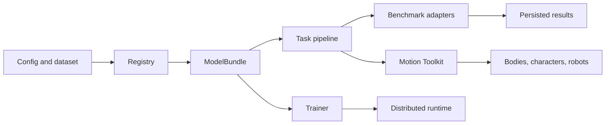

<p align="center">
  
</p>

<p align="center">
  <strong>Open infrastructure for human motion models, benchmarks, and interoperable motion data.</strong>
</p>

<p align="center">
  Train, run, compare, and connect motion systems without rebuilding the runtime around every method.
</p>

<p align="center">
  <a href="https://www.python.org/"></a>
  <a href="https://pytorch.org/"></a>
  <a href="docs/model_zoo/README.md"></a>
  <a href="docs/leaderboards/README.md"></a>
</p>

<p align="center">
  <a href="#start-here">🚀 Start</a> ·
  <a href="docs/tasks/README.md">🧭 Tasks</a> ·
  <a href="docs/model_zoo/README.md">📦 Models</a> ·
  <a href="docs/leaderboards/README.md">📊 Benchmarks</a> ·
  <a href="docs/motion/README.md">🔄 Motion I/O</a> ·
  <a href="docs/architecture.md">🏗️ Architecture</a>
</p>

Motius packages motion methods behind consistent bundles, task pipelines,
trainers, evaluators, and representation bridges.

| Layer | Owns | Source of truth |
| --- | --- | --- |
| 🧭 **Task** | Input and output contract | [Task Registry](docs/tasks/README.md) |
| 📦 **Method** | Model, checkpoint, pipeline, and native representation | [Model Zoo](docs/model_zoo/README.md) |
| 📊 **Benchmark** | Dataset, split, protocol, evaluator, and persisted results | [Benchmark Hub](docs/leaderboards/README.md) |
| 🔄 **Motion data** | Representation, body, character, and robot conversion | [Motion Toolkit](docs/motion/README.md) |

<a id="start-here"></a>

## Start Here 🚀

Install from source:

```bash
git clone https://github.com/ZeyuLing/Motius.git
cd Motius
python -m pip install -e ".[dev]"
```

Run a released Text-to-Motion model:

```python
from motius.pipelines.momask import MoMaskPipeline

pipe = MoMaskPipeline.from_pretrained(
    "ZeyuLing/hftrainer-momask-humanml3d",
    device="cuda",
)
motions = pipe.infer_t2m(
    ["a person walks forward and then sits down"],
    [120],
)
print(motions[0].shape)  # (120, 263), HumanML3D physical scale
```

Continue with the [installation and smoke tests](docs/getting_started.md), then
choose a [task](docs/tasks/README.md), a released
[method](docs/model_zoo/README.md), or a
[benchmark](docs/leaderboards/README.md).

## Task System 🧭

The [Task Registry](docs/tasks/README.md) is the only public task vocabulary.
Tracks such as prediction, in-betweening, sparse keyframes, and TP2M remain
inside their parent task. Dataset and model names never become task names.

| Family | Canonical tasks |
| --- | --- |
| ✨ **Motion generation** | [Text-to-Motion](https://huggingface.co/spaces/ZeyuLing/t2m-humanml3d-leaderboard) · [Sequential Text-to-Motion](https://huggingface.co/spaces/ZeyuLing/babel-sequential-generation-leaderboard) · [Text-to-Multi-Person Motion](docs/tasks/README.md#text-to-multi-person-motion) · [Music-to-Dance](https://huggingface.co/spaces/ZeyuLing/music-to-dance-aistpp-leaderboard) · [Speech-to-Gesture](https://huggingface.co/spaces/ZeyuLing/speech-to-gesture-beat2-leaderboard) |
| 🔎 **Motion understanding and translation** | [Motion-to-Text](https://huggingface.co/spaces/ZeyuLing/m2t-humanml3d-leaderboard) · [Dance-to-Music](https://huggingface.co/spaces/ZeyuLing/dance-to-music-aistpp-leaderboard) |
| 🎛️ **Motion control and completion** | [Temporal Motion Completion](https://huggingface.co/spaces/ZeyuLing/temporal-condition-leaderboard) · [Kinematic Motion Control](docs/tasks/README.md#kinematic-motion-control) · [Part-Level Motion Control](https://huggingface.co/spaces/ZeyuLing/body-part-condition-humanml3d-leaderboard) |
| ✂️ **Motion transformation and reconstruction** | [Motion Editing](https://huggingface.co/spaces/ZeyuLing/motion-edit-leaderboard) · [Motion Repair](docs/leaderboards/README.md#motion-repair-fixed-support-protocol) · [Motion Reconstruction](docs/leaderboards/README.md#motion-reconstruction-humanml3d) |

Model cards use these exact labels. Benchmark titles use
`Task · Dataset/Protocol`, such as
`Text-to-Motion · HumanML3D` and
`Sequential Text-to-Motion · BABEL`.

## Models And Benchmarks 📦

| Surface | Use it for | Includes |
| --- | --- | --- |
| 📦 **[Model Zoo](docs/model_zoo/README.md)** | Browse integrated methods; filter registered capabilities by task | 30 packages, native spaces, artifacts, papers, and validation boundaries |
| 📊 **[Benchmark Hub](docs/leaderboards/README.md)** | Compare persisted results under one protocol | 12 suites with public tables, metric contracts, and qualitative case explorers |
| ⚙️ **[Evaluator Zoo](docs/evaluator_zoo/README.md)** | Reuse a metric implementation | HumanML3D Official, MotionStreamer, InterCLIP, TMR-G1, AIST++, and joint-position evaluators |
| 🩺 **[Physical Metrics](docs/evaluation/physical_metrics.md)** | Diagnose motion quality without a semantic checkpoint | Foot slide, floating, jitter, dynamics, and floor penetration |

## Motion Interoperability 🔄

### Representation And Embodiment

<p align="center">
  
</p>

<p align="center">
  <code>HumanML3D-263</code> → <code>SMPL-22</code> → <code>SOMA-30</code> /
  <code>ARDY-Core-27</code> → <code>Unitree G1</code>
</p>

<p align="center">
  <a href="assets/motion/representation_demo/index.html"><strong>Open synchronized viewer</strong></a> ·
  <a href="docs/motion/representations.md">Representation matrix</a> ·
  <a href="docs/motion/conversion.md">Conversion API</a> ·
  <a href="docs/motion/retargeting.md">Retargeting routes</a>
</p>

The shared bridge connects native feature vectors, SMPL-family bodies,
kinematic skeletons, rigged characters, and robot embodiments. Exact routes
preserve source state; lossy joint-only and cross-skeleton routes expose their
IK or retargeting diagnostics.

Actor count is an orthogonal layout property. Single-person motion uses
`(T, D)`; paired and multi-person motion use `(T, A, D)` in one shared world
frame. The [GT InterX comparison](assets/motion/interhuman_representation_demo/interx_smplh_gt_G021T002A012R014_skeleton_smpl_mesh.gif)
and [Three.js viewer](assets/motion/interhuman_representation_demo/index.html)
show InterHuman-262 and SMPL-H under the same conversion contract.

### Character Export

<p align="center">
  
</p>

Any supported human-motion representation can pass through the SMPL-22 bridge
into a rigged FBX character. Compare the same motion as a skeleton, an SMPL
mesh, and four Mixamo characters in the
[30 fps character preview](assets/motion/fbx_character_demo/004822_skeleton_smpl_mixamo_1440_30fps.gif),
then follow the [FBX export guide](docs/motion/fbx.md).

## Train And Extend 🛠️

Train a Python config locally or with Accelerate:

```bash
python tools/train.py path/to/config.py --work-dir outputs/my_experiment
accelerate launch tools/train.py path/to/config.py \
  --work-dir outputs/my_distributed_experiment --auto-resume
```

A method package owns its model, bundle, trainer adapter, task pipeline, and
evaluation adapters. The common runtime owns distributed execution,
checkpoint I/O, registration, conversion, and lifecycle hooks.

Use the [architecture guide](docs/architecture.md) to add a package, the
[development guide](docs/development.md) for repository conventions, and the
[PRISM, TMR, and HY-Motion recipes](docs/training/prism_tmr_hymotion_t2m.md)
for released training examples.

## Architecture 🏗️



The split is intentional: a method can change architecture without renaming
its task, a benchmark can change dataset without becoming a new method, and a
motion representation can change without silently changing evaluation space.

## Documentation 📚

| Goal | Guide |
| --- | --- |
| Install and run a first model | [Getting Started](docs/getting_started.md) |
| Choose the correct public task name | [Task Registry](docs/tasks/README.md) |
| Find model packages and checkpoints | [Model Zoo](docs/model_zoo/README.md) |
| Compare methods under fixed protocols | [Benchmark Hub](docs/leaderboards/README.md) · [Evaluator Zoo](docs/evaluator_zoo/README.md) |
| Convert representations, bodies, or characters | [Motion Toolkit](docs/motion/README.md) |
| Understand or extend the runtime | [Architecture](docs/architecture.md) · [Development](docs/development.md) |
| Reproduce released training | [Training Recipes](docs/training/prism_tmr_hymotion_t2m.md) |

## Project Status 🚦

Motius is an active research release. Public artifacts are versioned,
evaluation protocols are persisted with their results, and method-specific
licenses and upstream attribution remain documented in each model card. Core
APIs may evolve as additional methods move onto the shared runtime.
