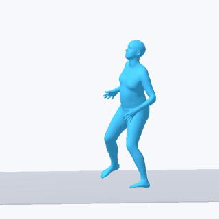

<p align="center">
  
</p>

<h1 align="center">Motius</h1>

<p align="center">
  <strong>A modular training, evaluation, and inference framework for human motion generation.</strong>
</p>

<p align="center">
  <a href="#model-zoo">Model Zoo</a> |
  <a href="docs/getting_started.md">Getting Started</a> |
  <a href="docs/architecture.md">Architecture</a> |
  <a href="docs/development.md">Development Guide</a>
</p>

Motius packages motion-generation methods as consistent model bundles,
trainers, pipelines, evaluators, and visualization utilities. The public repo
is being opened method by method: the reusable core is available now, and each
released method will ship with a model card, checkpoint path, evaluation
results, and qualitative SMPL renders.

## Model Zoo

| Method | Task | Motion Rep. | Checkpoint | Card | Upstream |
| ------ | ---- | ----------- | ---------- | ---- | -------- |
| MDM | Text-to-Motion | HumanML3D-263 | [HF](https://huggingface.co/ZeyuLing/hftrainer-mdm-humanml3d) | [Model Card](docs/model_zoo/mdm.md) | [Paper](https://arxiv.org/abs/2209.14916) / [Code](https://github.com/GuyTevet/motion-diffusion-model) |
| T2M-GPT | Text-to-Motion | HumanML3D-263 | [HF](https://huggingface.co/ZeyuLing/hftrainer-t2mgpt-humanml3d) | [Model Card](docs/model_zoo/t2mgpt.md) | [Paper](https://arxiv.org/abs/2301.06052) / [Code](https://github.com/Mael-zys/T2M-GPT) |
| MoMask | Text-to-Motion | HumanML3D-263 | [HF](https://huggingface.co/ZeyuLing/hftrainer-momask-humanml3d) | [Model Card](docs/model_zoo/momask.md) | [Paper](https://arxiv.org/abs/2312.00063) / [Code](https://github.com/EricGuo5513/momask-codes) |
| MoGenTS | Text-to-Motion | HumanML3D-263 | [HF](https://huggingface.co/ZeyuLing/hftrainer-mogents-humanml3d) | [Model Card](docs/model_zoo/mogents.md) | [Paper](https://arxiv.org/abs/2409.17686) / [Code](https://github.com/weihaosky/mogents) |
| MotionGPT | Text-to-Motion / Motion-to-Text | HumanML3D-263 | [HF](https://huggingface.co/ZeyuLing/hftrainer-motiongpt-humanml3d) | [Model Card](docs/model_zoo/motiongpt.md) | [Paper](https://arxiv.org/abs/2306.14795) / [Code](https://github.com/OpenMotionLab/MotionGPT) |
| MLD | Text-to-Motion | HumanML3D-263 | [HF](https://huggingface.co/ZeyuLing/hftrainer-mld-humanml3d) | [Model Card](docs/model_zoo/mld.md) | [Paper](https://arxiv.org/abs/2212.04048) / [Code](https://github.com/ChenFengYe/motion-latent-diffusion) |
| MotionLCM | Text-to-Motion | HumanML3D-263 | [HF](https://huggingface.co/ZeyuLing/hftrainer-motionlcm-humanml3d) | [Model Card](docs/model_zoo/motionlcm.md) | [Paper](https://arxiv.org/abs/2404.19759) / [Code](https://github.com/Dai-Wenxun/MotionLCM) |

### Preview Gallery

<p align="center">
  <a href="assets/model_zoo/mdm/mdm_humanml3d_001840_roundhouse_kick_smpl_mesh.mp4">
    
  </a>
</p>

<p align="center">
  <sub>MDM on HumanML3D test sample 001840: "someone executes a roundhouse kick with their left foot." Click to open the MP4 render.</sub>
</p>

## What Is Included

| Area | Purpose |
| ---- | ------- |
| `motius.registry` | Central registries for models, bundles, trainers, pipelines, datasets, hooks, evaluators, and visualizers. |
| `motius.models` | `ModelBundle` abstraction and model utility functions. |
| `motius.trainers` | Reusable trainer base classes for method-specific training logic. |
| `motius.pipelines` | Pipeline base classes for inference and task-facing APIs. |
| `motius.runner` | Accelerate-based distributed training runner and train loops. |
| `motius.datasets` | Dataset bases and reusable transform primitives. |
| `motius.hooks` | Checkpoint, EMA, logging, and learning-rate scheduler hooks. |
| `motius.evaluation` | Evaluator base interfaces. |
| `motius.visualization` | File and TensorBoard visualization bases. |
| `configs/_base_` | Minimal runtime config templates. |
| `tools/` | Command-line training entry points. |

## Quick Start

```bash
python -m pip install -e ".[dev]"
```

Run a lightweight import and registration check:

```bash
python - <<'PY'
import motius

motius.register_all_modules()
print("Motius core import OK")
PY
```

Run the current smoke tests:

```bash
pytest -q
```

## Documentation

The detailed architecture, extension points, and package conventions live in
the formal documentation:

- [Architecture](docs/architecture.md)
- [Getting Started](docs/getting_started.md)
- [Development Guide](docs/development.md)

## Release Status

Motius is an early public release. APIs may still change while research-specific
method code is separated from reusable framework code. New methods will be
added through scoped Model Zoo entries and model cards.
