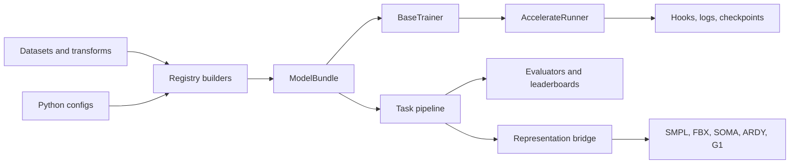

<p align="center">
  
</p>

<p align="center">
  <strong>A unified framework for training, evaluating, and translating human motion models.</strong>
</p>

<p align="center">
  One runtime for language, temporal control, interaction, audio, embodiment, and robot motion.
</p>

<p align="center">
  <a href="https://www.python.org/"></a>
  <a href="https://pytorch.org/"></a>
  <a href="docs/model_zoo/README.md"></a>
  <a href="docs/leaderboards/README.md"></a>
</p>

<p align="center">
  <a href="#quick-start">Quick Start</a> ·
  <a href="docs/tasks/README.md">Tasks</a> ·
  <a href="docs/model_zoo/README.md">Model Zoo</a> ·
  <a href="docs/leaderboards/README.md">Leaderboards</a> ·
  <a href="docs/motion/README.md">Motion Toolkit</a> ·
  <a href="docs/architecture.md">Architecture</a>
</p>

Motius packages motion methods behind consistent bundles, pipelines, trainers,
evaluators, and representation bridges. Reproduce a method, compare it under a
shared protocol, and move its output into another model, skeleton, renderer, or
character pipeline without rebuilding the surrounding infrastructure.

- **[Train](docs/getting_started.md#train-entry-point)** with distributed runners,
  reusable trainers, hooks, and resumable checkpoints.
- **[Run](docs/model_zoo/README.md)** released models through stable task-facing
  pipelines with physical-space outputs.
- **[Evaluate](docs/leaderboards/README.md)** with persisted protocols, semantic
  evaluators, physical diagnostics, and public case explorers.
- **[Translate](docs/motion/README.md)** between model-native motion formats,
  body models, robot embodiments, and rigged characters.

## Representation And Body Conversion

<p align="center">
  
</p>

<p align="center">
  <code>HumanML3D-263</code> → <code>SMPL-22</code> → <code>SOMA-30</code> /
  <code>ARDY-Core-27</code> → <code>Unitree G1</code>
</p>

<p align="center">
  <a href="assets/motion/representation_demo/index.html"><strong>Open synchronized viewer</strong></a> ·
  <a href="docs/motion/representations.md">Representation matrix</a> ·
  <a href="docs/motion/conversion.md">Conversion API</a> ·
  <a href="docs/motion/retargeting.md">Retargeting routes</a>
</p>

The comparison above follows one motion through native feature vectors,
SMPL-family bodies, kinematic skeletons, and a robot embodiment. The same
conversion bridge is actor-count agnostic: single-person motion uses `(T, D)`,
while paired and multi-person motion use `(T, A, D)` and preserve one shared
world frame. Representation conversion and retargeting run per actor without
independently recentering them, so relative position and facing remain intact.

InterHuman-262 is a motion representation within this shared actor layout, not
a separate "two-person representation" class. The
[GT InterX comparison](assets/motion/interhuman_representation_demo/interx_smplh_gt_G021T002A012R014_skeleton_smpl_mesh.gif)
and [Three.js viewer](assets/motion/interhuman_representation_demo/index.html)
show the same conversion route as paired InterHuman skeletons and SMPL-H
meshes. See the
[shared-frame conversion contract](docs/motion/representations.md#shared-frame-multi-actor-conversion).
Exact routes preserve source state; lossy joint-only and cross-skeleton routes
expose their IK or retargeting diagnostics.

### Character FBX Export

<p align="center">
  
</p>

Any supported representation can pass through the SMPL-22 bridge into a rigged
FBX character. Compare the same motion as an SMPL-22 skeleton, an exported SMPL
FBX, and four Mixamo characters in the
[30 fps character preview](assets/motion/fbx_character_demo/004822_skeleton_smpl_mixamo_1440_30fps.gif),
then follow the [FBX export guide](docs/motion/fbx.md).

## Quick Start

Install Motius from source:

```bash
git clone https://github.com/ZeyuLing/Motius.git
cd Motius
python -m pip install -e ".[dev]"
```

Run a released Text-to-Motion model through the shared pipeline API:

```python
from motius.pipelines.momask import MoMaskPipeline

pipe = MoMaskPipeline.from_pretrained(
    "ZeyuLing/hftrainer-momask-humanml3d",
    device="cuda",
)
motions = pipe.infer_t2m(
    ["a person walks forward and then sits down"],
    [120],
)
print(motions[0].shape)  # (120, 263), HumanML3D physical scale
```

Train a config locally or with Accelerate:

```bash
python tools/train.py path/to/config.py --work-dir outputs/my_experiment
accelerate launch tools/train.py path/to/config.py \
  --work-dir outputs/my_distributed_experiment --auto-resume
```

Continue with [installation and smoke tests](docs/getting_started.md), the
[architecture guide](docs/architecture.md), or the released
[PRISM, TMR, and HY-Motion training recipes](docs/training/prism_tmr_hymotion_t2m.md).

## Canonical Tasks

Motius uses one public task vocabulary across pipelines, model cards, and
leaderboards. Architecture terms such as *diffusion*, *autoregressive*,
*streaming*, and *zero-shot* describe methods, not tasks.

- **Language and motion:** [Text-to-Motion](https://huggingface.co/spaces/ZeyuLing/t2m-humanml3d-leaderboard)
  and [Motion-to-Text](https://huggingface.co/spaces/ZeyuLing/m2t-humanml3d-leaderboard).
- **Temporal generation:** [Temporal Condition](https://huggingface.co/spaces/ZeyuLing/temporal-condition-leaderboard)
  and [Sequential Generation](https://huggingface.co/spaces/ZeyuLing/babel-sequential-generation-leaderboard).
  Prediction, in-betweening, keyframes, and TP2M are Temporal Condition subtasks.
- **Spatial control:** [Body-Part Condition](https://huggingface.co/spaces/ZeyuLing/body-part-condition-humanml3d-leaderboard)
  and [Kinematic Control](docs/tasks/README.md#kinematic-control).
- **Editing:** [Motion Editing](https://huggingface.co/spaces/ZeyuLing/motion-edit-leaderboard)
  and [Instruction Editing](https://huggingface.co/spaces/ZeyuLing/instruction-editing-leaderboard).
- **Audio-driven motion:** [Music-to-Dance](https://huggingface.co/spaces/ZeyuLing/music-to-dance-aistpp-leaderboard),
  [Dance-to-Music](https://huggingface.co/spaces/ZeyuLing/dance-to-music-aistpp-leaderboard),
  and [Speech-to-Gesture](https://huggingface.co/spaces/ZeyuLing/speech-to-gesture-beat2-leaderboard).
- **Interaction and robotics:** [Two-Person Text-to-Motion](docs/tasks/README.md#two-person-text-to-motion)
  and [Robot Motion Control](docs/tasks/README.md#robot-motion-control).

Read the **[task definitions and API contracts](docs/tasks/README.md)** before
adding a pipeline or model card.

## Architecture



Method packages own their model, trainer, pipeline, and evaluation adapters.
The common runtime owns distributed execution, checkpoint IO, registration,
conversion, and lifecycle hooks. See
[core concepts](docs/architecture.md#core-concepts),
[method package conventions](docs/architecture.md#method-package-convention),
and the [development guide](docs/development.md).

## Model Zoo

Thirty reproduced or Motius-native packages document their task surface, native
representation, checkpoints, evaluation protocol, paper, and original code.

- **General motion:** [PRISM](docs/model_zoo/prism.md) ·
  [MoMask](docs/model_zoo/momask.md) ·
  [FlowMDM](docs/model_zoo/flowmdm.md) ·
  [MotionStreamer](docs/model_zoo/motionstreamer.md) ·
  [HY-Motion T2M](docs/model_zoo/hymotion_t2m.md)
- **Language models:** [MotionGPT](docs/model_zoo/motiongpt.md) ·
  [MotionGPT3](docs/model_zoo/motiongpt3.md) ·
  [TM2T](docs/model_zoo/tm2t.md) ·
  [VerMo](docs/model_zoo/vermo.md)
- **Control and interaction:** [OmniControl](docs/model_zoo/omnicontrol.md) ·
  [MaskControl](docs/model_zoo/maskcontrol.md) ·
  [KIMODO](docs/model_zoo/kimodo.md) ·
  [InterGen](docs/model_zoo/intergen.md) ·
  [InterMask](docs/model_zoo/intermask.md)
- **Audio and embodiment:** [UniMuMo](docs/model_zoo/unimumo.md) ·
  [Bailando](docs/model_zoo/bailando.md) ·
  [EDGE](docs/model_zoo/edge.md) ·
  [TM2D](docs/model_zoo/tm2d.md) ·
  [ARDY](docs/model_zoo/ardy.md) ·
  [MotionBricks](docs/model_zoo/motionbricks.md)

Browse the **[complete Model Zoo](docs/model_zoo/README.md)** for all methods,
canonical capabilities, native representations, checkpoints, papers, and code.

## Leaderboards

Motius maintains twelve benchmark families. Dataset variants and subtasks remain
nested under their canonical task; TP2M belongs to Temporal Condition, and
PRISM-MCM is a method within Music-to-Dance and Speech-to-Gesture.

- **Generation and understanding:** [T2M HumanML3D](https://huggingface.co/spaces/ZeyuLing/t2m-humanml3d-leaderboard) ·
  [M2T HumanML3D](https://huggingface.co/spaces/ZeyuLing/m2t-humanml3d-leaderboard) ·
  [Reconstruction](docs/leaderboards/README.md#reconstruction)
- **Conditional and sequential:** [Temporal Condition](https://huggingface.co/spaces/ZeyuLing/temporal-condition-leaderboard) ·
  [Body-Part Condition](https://huggingface.co/spaces/ZeyuLing/body-part-condition-humanml3d-leaderboard) ·
  [BABEL Sequential Generation](https://huggingface.co/spaces/ZeyuLing/babel-sequential-generation-leaderboard)
- **Editing and repair:** [Motion Editing](https://huggingface.co/spaces/ZeyuLing/motion-edit-leaderboard) ·
  [Instruction Editing](https://huggingface.co/spaces/ZeyuLing/instruction-editing-leaderboard) ·
  [Motion Repair](docs/leaderboards/README.md#motion-repair)
- **Audio-driven motion:** [Music-to-Dance](https://huggingface.co/spaces/ZeyuLing/music-to-dance-aistpp-leaderboard) ·
  [Dance-to-Music](https://huggingface.co/spaces/ZeyuLing/dance-to-music-aistpp-leaderboard) ·
  [Speech-to-Gesture](https://huggingface.co/spaces/ZeyuLing/speech-to-gesture-beat2-leaderboard)

The **[Leaderboard Hub](docs/leaderboards/README.md)** records the dataset,
split, evaluator, public page, source implementation, and protocol boundary for
every family.

## Evaluation

- [HumanML3D Official](docs/evaluator_zoo/humanml3d_official.md) reproduces the
  paper-compatible retrieval, FID, MM-Dist, and diversity protocol.
- [MotionStreamer](docs/evaluator_zoo/motionstreamer.md) provides
  cross-representation semantic evaluation in MotionStreamer-272.
- [Motius Joint-Position](docs/evaluator_zoo/motius_joint_position.md) evaluates
  all compatible methods on a shared SMPL-22 joint space.
- [TMR-G1](docs/evaluator_zoo/g1_tmr.md) evaluates robot-native text and motion.
- [InterCLIP](docs/evaluator_zoo/interclip.md) evaluates text-conditioned
  two-person interaction.
- [AIST++ Music-to-Dance](docs/evaluator_zoo/aistpp_music_to_dance.md) reports
  kinetic/geometric FID, beat alignment, diversity, and physical diagnostics.

Checkpoint-free [physical metrics](docs/evaluation/physical_metrics.md) report
foot slide, floating, jitter, dynamic motion, and floor penetration under the
same canonical skeleton protocol used by the leaderboards.

## Motion Toolkit

The shared SMPL-22 bridge connects model-native formats without pretending that
every conversion is lossless:

`HumanML3D-263` · `motion135` · `MotionStreamer-272` · `HY-Motion-201` ·
`BABEL-135` · `DART276` · `InterHuman-262` · `SOMA` · `ARDY-330` ·
`Unitree G1` · rigged `FBX`

```python
from motius.motion import convert_motion

smpl_motion = convert_motion(motion_hy201, "hymotion201", "motion135")
motion_ms272 = convert_motion(smpl_motion, "motion135", "ms272")
```

Start with the [Motion Toolkit](docs/motion/README.md), then open the
[representation matrix](docs/motion/representations.md),
[conversion guide](docs/motion/conversion.md),
[retargeting guide](docs/motion/retargeting.md), or
[FBX export guide](docs/motion/fbx.md). SMPL/SMPL-H files are licensed assets
and must be downloaded separately into `checkpoints/body_models/`.

## Documentation

[Getting Started](docs/getting_started.md) ·
[Task Definitions](docs/tasks/README.md) ·
[Architecture](docs/architecture.md) ·
[Model Zoo](docs/model_zoo/README.md) ·
[Leaderboard Hub](docs/leaderboards/README.md) ·
[Evaluator Zoo](docs/evaluator_zoo) ·
[Motion Toolkit](docs/motion/README.md) ·
[Training Recipes](docs/training/prism_tmr_hymotion_t2m.md) ·
[Development](docs/development.md)

## Project Status

Motius is an active research release. Public artifacts are versioned,
evaluation protocols are persisted with their results, and method-specific
licenses and upstream attribution remain documented in each model card. Core
APIs may evolve as additional methods move onto the shared runtime.
