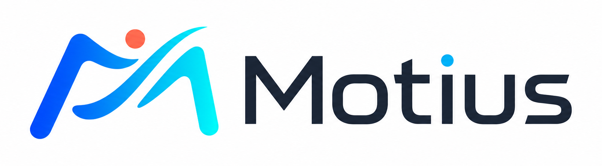
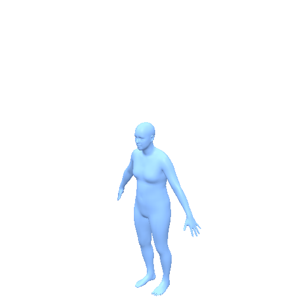
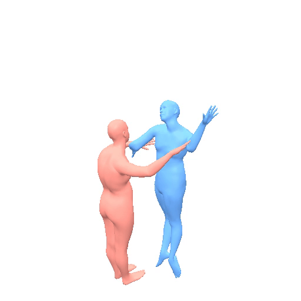
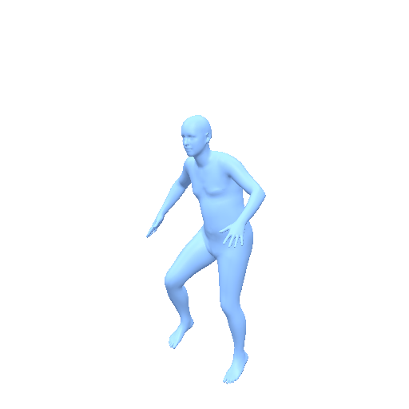
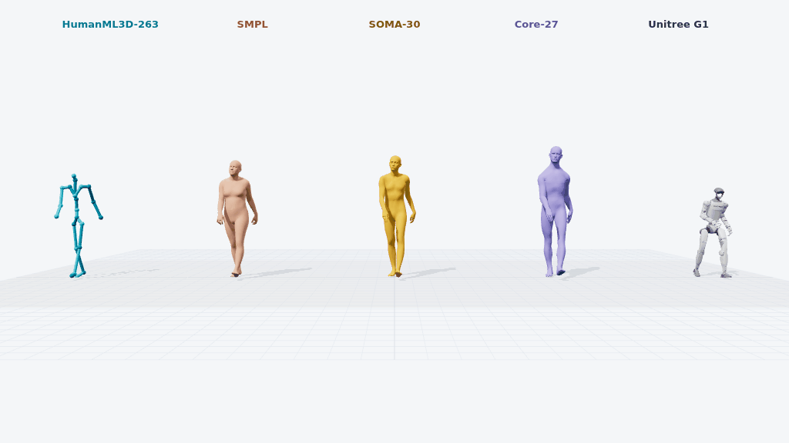
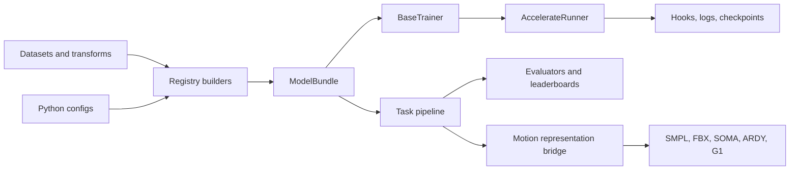

<p align="center">
  
</p>

<p align="center">
  <strong>A unified framework for training, evaluating, and deploying human motion models.</strong>
</p>

<p align="center">
  One runtime for text, motion, temporal control, interaction, audio, and robot motion.
</p>

<p align="center">
  <a href="https://www.python.org/"></a>
  <a href="https://pytorch.org/"></a>
  <a href="docs/model_zoo/README.md"></a>
  <a href="docs/leaderboards/README.md"></a>
</p>

<p align="center">
  <a href="#quick-start">Quick Start</a> ·
  <a href="docs/model_zoo/README.md">Model Zoo</a> ·
  <a href="docs/leaderboards/README.md">Leaderboards</a> ·
  <a href="#motion-toolkit">Motion Toolkit</a> ·
  <a href="docs/getting_started.md">Documentation</a>
</p>

Motius packages motion methods behind consistent bundles, pipelines, training
loops, evaluators, and representation bridges. It is designed for researchers
who need to reproduce a method, compare it under a shared protocol, and move
its output into another model, skeleton, renderer, or character pipeline.

| **Train** | **Generate** | **Evaluate** | **Interoperate** |
| --- | --- | --- | --- |
| Accelerate-based distributed runners, reusable trainers, hooks, and resumable checkpoints | Stable task pipelines for single-person, two-person, temporal, audio, and robot motion | Persisted semantic evaluators, physical diagnostics, and auditable public leaderboards | Validated conversion across SMPL, HumanML3D, MotionStreamer, InterHuman, SOMA, ARDY, G1, and FBX |

## Motius in Motion

<table>
  <tr>
    <td width="50%" align="center">
      <br>
      <strong>Text-to-Motion</strong><br>
      <sub>PRISM-KT · “a person jumping while raising both hands and moving apart legs” · 30 fps</sub><br>
      <a href="docs/model_zoo/prism.md">Model card</a> · <a href="https://huggingface.co/spaces/ZeyuLing/t2m-humanml3d-leaderboard">Leaderboard</a>
    </td>
    <td width="50%" align="center">
      <br>
      <strong>Two-Person Interaction</strong><br>
      <sub>InterMask · “two people hug each other and then step back” · 30 fps</sub><br>
      <a href="docs/model_zoo/intermask.md">Model card</a> · <a href="assets/motion/interhuman_representation_demo/index.html">Representation viewer</a>
    </td>
  </tr>
  <tr>
    <td width="50%" align="center">
      <br>
      <strong>Music-to-Dance</strong><br>
      <sub>Bailando · AIST++ krump sequence · SMPL mesh at 30 fps</sub><br>
      <a href="docs/model_zoo/bailando.md">Model card</a> · <a href="https://huggingface.co/spaces/ZeyuLing/music-to-dance-aistpp-leaderboard">Leaderboard</a>
    </td>
    <td width="50%" align="center">
      <br>
      <strong>One Motion, Many Embodiments</strong><br>
      <sub>HumanML3D · SMPL · SOMA · ARDY · Unitree G1</sub><br>
      <a href="assets/motion/representation_demo/index.html">Synchronized viewer</a> · <a href="docs/motion/representations.md">Protocol</a>
    </td>
  </tr>
</table>

## Quick Start

Install Motius from source:

```bash
git clone https://github.com/ZeyuLing/Motius.git
cd Motius
python -m pip install -e ".[dev]"
```

Run a released text-to-motion model through the shared pipeline API:

```python
from motius.pipelines.momask import MoMaskPipeline

pipe = MoMaskPipeline.from_pretrained(
    "ZeyuLing/hftrainer-momask-humanml3d",
    device="cuda",
)
motions = pipe.infer_t2m(
    ["a person walks forward and then sits down"],
    [120],
)
print(motions[0].shape)  # (120, 263), HumanML3D physical scale
```

Train a config locally or with Accelerate:

```bash
python tools/train.py path/to/config.py --work-dir outputs/my_experiment
accelerate launch tools/train.py path/to/config.py \
  --work-dir outputs/my_distributed_experiment --auto-resume
```

See [Getting Started](docs/getting_started.md) for environment setup and the
[training guide](docs/training/prism_tmr_hymotion_t2m.md) for released recipes.

## Task Coverage

| Domain | Supported tasks | Representative methods |
| --- | --- | --- |
| Language and motion | Text-to-Motion, Motion-to-Text | PRISM, MoMask, MotionGPT, TM2T, VerMo |
| Temporal generation | Prediction, in-betweening, keyframes, TP2M, sequential composition | FlowMDM, MotionStreamer, PRISM, MaskControl, KIMODO |
| Spatial control | Joint, body-part, trajectory, and kinematic conditioning | CondMDI, OmniControl, MaskControl, DART, ARDY |
| Multimodal motion | Music-to-Dance, Dance-to-Music, Speech-to-Gesture | Bailando, EDGE, TM2D, UniMuMo, PRISM-MCM |
| Interaction | Two-person text-to-motion | InterGen, InterMask |
| Embodiment | SMPL character export, SOMA and Unitree G1 retargeting | KIMODO, ARDY, MotionBricks |

## Architecture



Method packages own their model, trainer, pipeline, and evaluation adapters;
the common runtime owns distributed execution, checkpoint IO, registration,
and lifecycle hooks. Read the [architecture guide](docs/architecture.md) to add
a method without coupling it to another implementation.

## Model Zoo

Thirty reproduced or Motius-native method packages are documented with their
task surface, native representation, checkpoints, evaluation protocol, and
upstream attribution.

| Method | Focus | Native representation | Resources |
| --- | --- | --- | --- |
| PRISM | T2M, temporal and sequential generation | PRISM Motion-138 | [Card](docs/model_zoo/prism.md) · [1.0](https://huggingface.co/ZeyuLing/motius-prism-1.0-humanml3d) · [KT](https://huggingface.co/ZeyuLing/motius-prism-kt-humanml3d) |
| MoMask | Masked-token T2M | HumanML3D-263 | [Card](docs/model_zoo/momask.md) · [Checkpoint](https://huggingface.co/ZeyuLing/hftrainer-momask-humanml3d) |
| FlowMDM | T2M and sequential generation | HumanML3D-263 / BABEL-135 | [Card](docs/model_zoo/flowmdm.md) · [Checkpoint](https://huggingface.co/ZeyuLing/hftrainer-flowmdm-humanml3d) |
| UniMuMo | Motion and music generation | HumanML3D-263 / audio 32 kHz | [Card](docs/model_zoo/unimumo.md) · [Checkpoint](https://huggingface.co/ZeyuLing/Motius-UniMuMo) |
| InterMask | Two-person interaction | paired InterHuman-262 | [Card](docs/model_zoo/intermask.md) · [Checkpoint](https://huggingface.co/ZeyuLing/motius-intermask-interhuman) |
| HY-Motion T2M | Large-scale T2M | HY-Motion-201 | [Card](docs/model_zoo/hymotion_t2m.md) · [Full](https://huggingface.co/ZeyuLing/hftrainer-hymotion-t2m-1.0) · [Lite](https://huggingface.co/ZeyuLing/hftrainer-hymotion-t2m-1.0-lite) |
| KIMODO | Motion generation and embodiment | SOMA / G1 / SMPL-X | [Card](docs/model_zoo/kimodo.md) · [SOMA-RP](https://huggingface.co/ZeyuLing/hftrainer-kimodo-soma-rp) |
| ARDY | Autoregressive motion and robot control | ARDY-330 / G1 | [Card](docs/model_zoo/ardy.md) · [Core](https://huggingface.co/nvidia/ARDY-Core-RP-20FPS-Horizon40) |

Browse the **[complete Model Zoo](docs/model_zoo/README.md)** for all 30
methods, including checkpoints, model cards, papers, and original code.

## Leaderboards

Motius maintains twelve top-level benchmark families. Subtasks remain nested
under their parent protocol: TP2M belongs to Temporal Condition, while
PRISM-MCM is evaluated as a method within Music-to-Dance.

<table>
  <tr>
    <td width="50%"><strong>Generation and Understanding</strong><br><a href="https://huggingface.co/spaces/ZeyuLing/t2m-humanml3d-leaderboard">T2M HumanML3D</a><br><a href="https://huggingface.co/spaces/ZeyuLing/m2t-humanml3d-leaderboard">M2T HumanML3D</a><br><a href="docs/leaderboards/README.md#reconstruction">Reconstruction HumanML3D</a></td>
    <td width="50%"><strong>Conditional and Sequential</strong><br><a href="https://huggingface.co/spaces/ZeyuLing/temporal-condition-leaderboard">Temporal Condition</a> <sub>Prediction · In-betweening · Keyframes · TP2M</sub><br><a href="https://huggingface.co/spaces/ZeyuLing/body-part-condition-humanml3d-leaderboard">Body-Part Condition</a><br><a href="https://huggingface.co/spaces/ZeyuLing/babel-sequential-generation-leaderboard">BABEL Sequential Generation</a></td>
  </tr>
  <tr>
    <td width="50%"><strong>Editing and Repair</strong><br><a href="https://huggingface.co/spaces/ZeyuLing/motion-edit-leaderboard">Motion Editing</a> <sub>Style · Content</sub><br><a href="https://huggingface.co/spaces/ZeyuLing/instruction-editing-leaderboard">Instruction Editing</a><br><a href="docs/leaderboards/README.md#motion-repair">Motion Repair</a></td>
    <td width="50%"><strong>Audio-Driven Motion</strong><br><a href="https://huggingface.co/spaces/ZeyuLing/music-to-dance-aistpp-leaderboard">Music-to-Dance</a> <sub>AIST++ · PRISM-MCM</sub><br><a href="https://huggingface.co/spaces/ZeyuLing/dance-to-music-aistpp-leaderboard">Dance-to-Music</a><br><a href="https://huggingface.co/spaces/ZeyuLing/speech-to-gesture-beat2-leaderboard">Speech-to-Gesture</a></td>
  </tr>
</table>

The **[Leaderboard Hub](docs/leaderboards/README.md)** records dataset,
protocol, evaluator, public-page status, and source location for every family.

## Evaluation

| Evaluator | Purpose | Representation |
| --- | --- | --- |
| [HumanML3D Official](docs/evaluator_zoo/humanml3d_official.md) | Paper-compatible T2M retrieval, FID, MM-Dist, and diversity | HumanML3D-263 |
| [MotionStreamer](docs/evaluator_zoo/motionstreamer.md) | Cross-representation semantic evaluation | MotionStreamer-272 |
| [Motius Joint-Position](docs/evaluator_zoo/motius_joint_position.md) | Unified SMPL-22 text-motion evaluation | SMPL-22 joints66 |
| [TMR-G1](docs/evaluator_zoo/g1_tmr.md) | Robot-native text-motion evaluation | Unitree G1-38D |
| [InterCLIP](docs/evaluator_zoo/interclip.md) | Text-interaction evaluation | paired InterHuman-262 |
| [AIST++ Music-to-Dance](docs/evaluator_zoo/aistpp_music_to_dance.md) | Kinetic/geometric FID, beat alignment, and diversity | AIST++ / SMPL-22 |

Checkpoint-free [physical metrics](docs/evaluation/physical_metrics.md) report
foot slide, floating, jitter, dynamic motion, and floor penetration under the
same canonical skeleton protocol used by the leaderboards.

## Motion Toolkit

The shared SMPL-22 bridge connects model-native formats without pretending
that every conversion is lossless:

`HumanML3D-263` · `motion135` · `MotionStreamer-272` · `HY-Motion-201` ·
`BABEL-135` · `DART276` · `InterHuman-262` · `SOMA` · `ARDY-330` ·
`Unitree G1` · rigged `FBX`

```python
from motius.motion import convert_motion

smpl_motion = convert_motion(motion_hy201, "hymotion201", "motion135")
motion_ms272 = convert_motion(smpl_motion, "motion135", "ms272")
```

Exact routes preserve source state; joint-only and cross-skeleton routes expose
IK or retargeting diagnostics. See the [representation matrix](docs/motion/representations.md),
[conversion guide](docs/motion/conversion.md), [retargeting guide](docs/motion/retargeting.md),
and [FBX export guide](docs/motion/fbx.md). SMPL/SMPL-H files are licensed
assets and must be downloaded separately into `checkpoints/body_models/`.

### Two-Person Representation Demo

The GT InterX preview decodes one synchronized pair into SMPL-22 skeletons and
paired meshes, preserving the shared world frame used by `InterHuman-262`.
[Open the 30 fps comparison](assets/motion/interhuman_representation_demo/interx_smplh_gt_G021T002A012R014_skeleton_smpl_mesh.gif),
inspect it in the [Three.js viewer](assets/motion/interhuman_representation_demo/index.html),
or read the [two-person representation protocol](docs/motion/representations.md#two-person-interhuman-preview).

### Character FBX Export

Any supported representation can be exported through the SMPL-22 bridge onto
a rigged FBX character. Exact rotation routes remain exact; joint-only and
robot routes record their IK or retargeting error. Compare the same motion as
an SMPL-22 skeleton, an exported SMPL FBX, and four Mixamo characters in the
[30 fps character preview](assets/motion/fbx_character_demo/004822_skeleton_smpl_mixamo_1440_30fps.gif).

## Documentation

| Guide | Contents |
| --- | --- |
| [Getting Started](docs/getting_started.md) | Installation, smoke tests, training entry points, and outputs |
| [Architecture](docs/architecture.md) | Registries, bundles, trainers, pipelines, runners, and hooks |
| [Model Zoo](docs/model_zoo/README.md) | Complete method, checkpoint, and attribution index |
| [Leaderboard Hub](docs/leaderboards/README.md) | Canonical benchmark taxonomy and public evaluation pages |
| [Motion Toolkit](docs/motion/README.md) | Representations, conversion, retargeting, and character export |
| [Training Recipes](docs/training/prism_tmr_hymotion_t2m.md) | Released PRISM, TMR, and HY-Motion T2M training configurations |
| [Development](docs/development.md) | Package conventions and extension workflow |

## Project Status

Motius is an active research release. Public model artifacts are versioned,
evaluation protocols are persisted with their results, and method-specific
licenses and upstream attribution remain documented in each model card. Core
APIs may still evolve as additional methods move onto the shared runtime.
