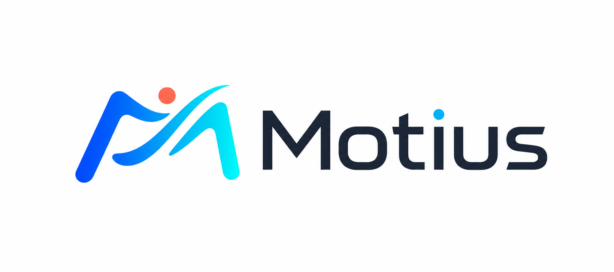

<p align="center">
  
</p>

# Motius

Motius is a reproducible framework for human motion models.

This repository is being opened incrementally. The first public push contains
the framework core: registries, model bundles, trainers, pipelines, hooks,
distributed runner utilities, visualization bases, and minimal runtime configs.
Method packages, evaluators, model cards, checkpoints, and datasets will be
reviewed and added in separate commits.

## What Is Included Now

- Registry system for models, bundles, trainers, pipelines, datasets, hooks,
  evaluators, and visualizers.
- `ModelBundle`, `BaseTrainer`, and `BasePipeline` abstractions.
- Accelerate-based training runner and loop helpers.
- Core hooks for checkpoints, EMA, logging, and LR scheduling.
- Dataset transform bases and visualization bases.
- Minimal config templates under `configs/_base_`.

## Namespace Note

The public project name is **Motius**. The code currently keeps the historical
`hftrainer` Python namespace for compatibility with the internal codebase while
method packages are migrated. A lightweight `motius` namespace is also provided
and currently re-exports the core framework API.

## Development Status

This is an early public core drop. APIs may still change while we separate
research-specific method code from reusable framework code.

## Quick Smoke Test

```bash
python - <<'PY'
import motius
motius.register_all_modules()
print("Motius core import OK")
PY
```
