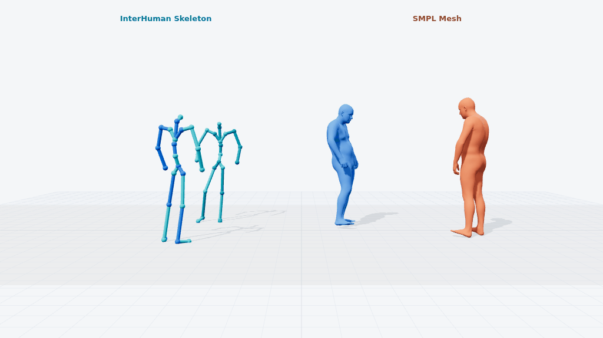

<p align="center">
  
</p>

<h1 align="center">Motius</h1>

<p align="center">
  <strong>A modular training, evaluation, and inference framework for human motion generation.</strong>
</p>

<p align="center">
  <a href="#model-zoo">Model Zoo</a> |
  <a href="#leaderboards">Leaderboards</a> |
  <a href="#evaluator-zoo">Evaluator Zoo</a> |
  <a href="#motion-representation-toolkit">Motion Toolkit</a> |
  <a href="docs/getting_started.md">Getting Started</a> |
  <a href="docs/architecture.md">Architecture</a> |
  <a href="docs/development.md">Development Guide</a>
</p>

Motius packages motion-generation methods as consistent model bundles,
trainers, pipelines, evaluators, and visualization utilities. The public repo
is being opened method by method: the reusable core is available now, and each
released method will ship with a model card, checkpoint path, evaluation
results, and qualitative SMPL renders.

Motius also ships an explicit [Motion Toolkit](docs/motion/README.md) for
converting HML263, AIST++ SMPL-24 joints, MotionStreamer-272, HY-Motion-201, DART276,
InterHuman-262, ARDY-330, Unitree G1, and SMPL
`motion135`, plus SMPL/SOMA/G1 retargeting. Its documentation records skeleton,
coordinate, FPS, and 6D rotation conventions for every route.

## Model Zoo

Task labels use a controlled vocabulary: [`T2M`](https://huggingface.co/spaces/ZeyuLing/t2m-humanml3d-leaderboard), [`M2T`](https://huggingface.co/spaces/ZeyuLing/m2t-humanml3d-leaderboard),
[`Temporal Condition`](https://huggingface.co/spaces/ZeyuLing/temporal-condition-leaderboard),
`Body-Part Condition`, `Two-Person T2M`, [`Sequential Generation`](https://huggingface.co/spaces/ZeyuLing/babel-sequential-generation-leaderboard), [`Music-to-Dance`](https://huggingface.co/spaces/ZeyuLing/music-to-dance-aistpp-leaderboard), [`Dance-to-Music`](https://huggingface.co/spaces/ZeyuLing/dance-to-music-aistpp-leaderboard), `Motion Control`, and `Kinematic Control`. Properties such
as zero-shot, streaming, latent, or autoregressive are described in the model
cards rather than treated as separate tasks.

| Method | Tasks | Motion Rep. | Checkpoint | Card | References |
| ------ | ---- | ----------- | ---------- | ---- | ---------- |
| MDM | [T2M](https://huggingface.co/spaces/ZeyuLing/t2m-humanml3d-leaderboard) | HumanML3D-263 | [HF](https://huggingface.co/ZeyuLing/hftrainer-mdm-humanml3d) | [Model Card](docs/model_zoo/mdm.md) | [Paper](https://arxiv.org/abs/2209.14916) / [Code](https://github.com/GuyTevet/motion-diffusion-model) |
| T2M-GPT | [T2M](https://huggingface.co/spaces/ZeyuLing/t2m-humanml3d-leaderboard) | HumanML3D-263 | [HF](https://huggingface.co/ZeyuLing/hftrainer-t2mgpt-humanml3d) | [Model Card](docs/model_zoo/t2mgpt.md) | [Paper](https://arxiv.org/abs/2301.06052) / [Code](https://github.com/Mael-zys/T2M-GPT) |
| MoMask | [T2M](https://huggingface.co/spaces/ZeyuLing/t2m-humanml3d-leaderboard) | HumanML3D-263 | [HF](https://huggingface.co/ZeyuLing/hftrainer-momask-humanml3d) | [Model Card](docs/model_zoo/momask.md) | [Paper](https://arxiv.org/abs/2312.00063) / [Code](https://github.com/EricGuo5513/momask-codes) |
| MoGenTS | [T2M](https://huggingface.co/spaces/ZeyuLing/t2m-humanml3d-leaderboard) | HumanML3D-263 | [HF](https://huggingface.co/ZeyuLing/hftrainer-mogents-humanml3d) | [Model Card](docs/model_zoo/mogents.md) | [Paper](https://arxiv.org/abs/2409.17686) / [Code](https://github.com/weihaosky/mogents) |
| TM2T | [M2T](https://huggingface.co/spaces/ZeyuLing/m2t-humanml3d-leaderboard) | HumanML3D-263 | [HF](https://huggingface.co/ZeyuLing/Motius-TM2T-HumanML3D) | [Model Card](docs/model_zoo/tm2t.md) | [Paper](https://arxiv.org/abs/2207.01696) / [Code](https://github.com/EricGuo5513/TM2T) |
| MotionGPT | [T2M](https://huggingface.co/spaces/ZeyuLing/t2m-humanml3d-leaderboard), [M2T](https://huggingface.co/spaces/ZeyuLing/m2t-humanml3d-leaderboard) | HumanML3D-263 | [HF](https://huggingface.co/ZeyuLing/Motius-MotionGPT-HumanML3D) | [Model Card](docs/model_zoo/motiongpt.md) | [Paper](https://arxiv.org/abs/2306.14795) / [Code](https://github.com/OpenMotionLab/MotionGPT) |
| MotionGPT3 | [M2T](https://huggingface.co/spaces/ZeyuLing/m2t-humanml3d-leaderboard) | HumanML3D-263 | [HF](https://huggingface.co/ZeyuLing/Motius-MotionGPT3-HumanML3D) | [Model Card](docs/model_zoo/motiongpt3.md) | [Paper](https://arxiv.org/abs/2506.24086) / [Code](https://github.com/OpenMotionLab/MotionGPT3) |
| Bailando | [Music-to-Dance](https://huggingface.co/spaces/ZeyuLing/music-to-dance-aistpp-leaderboard) | AIST++ SMPL-24 joints | [HF](https://huggingface.co/ZeyuLing/Motius-Bailando-AISTPP) | [Model Card](docs/model_zoo/bailando.md) | [Paper](https://arxiv.org/abs/2203.13055) / [Code](https://github.com/lisiyao21/Bailando) |
| EDGE | [Music-to-Dance](https://huggingface.co/spaces/ZeyuLing/music-to-dance-aistpp-leaderboard) | EDGE-151 / SMPL rotations | [HF](https://huggingface.co/ZeyuLing/Motius-EDGE-AISTPP) | [Model Card](docs/model_zoo/edge.md) | [Paper](https://arxiv.org/abs/2211.10658) / [Code](https://github.com/Stanford-TML/EDGE) |
| TM2D | [T2M](https://huggingface.co/spaces/ZeyuLing/t2m-humanml3d-leaderboard), [Music-to-Dance](https://huggingface.co/spaces/ZeyuLing/music-to-dance-aistpp-leaderboard) | TM2D-287 / SMPL-24 joints | [HF](https://huggingface.co/ZeyuLing/Motius-TM2D-HumanML3D-AISTPP) | [Model Card](docs/model_zoo/tm2d.md) | [Paper](https://openaccess.thecvf.com/content/ICCV2023/papers/Gong_TM2D_Bimodality_Driven_3D_Dance_Generation_via_Music-Text_Integration_ICCV_2023_paper.pdf) / [Code](https://github.com/Garfield-kh/TM2D) |
| UniMuMo | [T2M](https://huggingface.co/spaces/ZeyuLing/t2m-humanml3d-leaderboard), [M2T](https://huggingface.co/spaces/ZeyuLing/m2t-humanml3d-leaderboard), [Music-to-Dance](https://huggingface.co/spaces/ZeyuLing/music-to-dance-aistpp-leaderboard), [Dance-to-Music](https://huggingface.co/spaces/ZeyuLing/dance-to-music-aistpp-leaderboard) | HumanML3D-263 / audio 32 kHz | [HF](https://huggingface.co/ZeyuLing/Motius-UniMuMo) | [Model Card](docs/model_zoo/unimumo.md) | [Paper](https://arxiv.org/abs/2410.04534) / [Code](https://github.com/hanyangclarence/UniMuMo) |
| VerMo | [M2T](https://huggingface.co/spaces/ZeyuLing/m2t-humanml3d-leaderboard) | VerMo-138 via SMPL-22 | [HF](https://huggingface.co/ZeyuLing/Motius-VerMo-HumanML3D) | [Model Card](docs/model_zoo/vermo.md) | [Motius Code](https://github.com/ZeyuLing/Motius/tree/main/motius/models/vermo) |
| FlowMDM | [T2M](https://huggingface.co/spaces/ZeyuLing/t2m-humanml3d-leaderboard), [Sequential Generation](https://huggingface.co/spaces/ZeyuLing/babel-sequential-generation-leaderboard), [TP2M](https://huggingface.co/spaces/ZeyuLing/temporal-condition-leaderboard) | HumanML3D-263 / BABEL-135 | [HML3D](https://huggingface.co/ZeyuLing/hftrainer-flowmdm-humanml3d) / [BABEL](https://huggingface.co/ZeyuLing/motius-flowmdm-babel) | [Model Card](docs/model_zoo/flowmdm.md) | [Paper](https://arxiv.org/abs/2402.15509) / [Code](https://github.com/BarqueroGerman/FlowMDM) |
| MotionCLR | [T2M](https://huggingface.co/spaces/ZeyuLing/t2m-humanml3d-leaderboard) | HumanML3D-263 | [HF](https://huggingface.co/ZeyuLing/motius-motionclr-humanml3d) | [Model Card](docs/model_zoo/motionclr.md) | [Paper](https://arxiv.org/abs/2410.18977) / [Code](https://github.com/IDEA-Research/MotionCLR) |
| MotionMillion | [T2M](https://huggingface.co/spaces/ZeyuLing/t2m-humanml3d-leaderboard) | MotionStreamer-272 | [7B](https://huggingface.co/ZeyuLing/hftrainer-gotozero-7b-train-humanml272) / [3B](https://huggingface.co/ZeyuLing/hftrainer-gotozero-3b-train-humanml272) | [Model Card](docs/model_zoo/motionmillion.md) | [Paper](https://arxiv.org/abs/2507.07095) / [Code](https://github.com/VankouF/MotionMillion-Codes) |
| MotionStreamer | [T2M](https://huggingface.co/spaces/ZeyuLing/t2m-humanml3d-leaderboard), [Sequential Generation](https://huggingface.co/spaces/ZeyuLing/babel-sequential-generation-leaderboard), [TP2M](https://huggingface.co/spaces/ZeyuLing/temporal-condition-leaderboard) | MotionStreamer-272 | [HF](https://huggingface.co/ZeyuLing/hftrainer-motionstreamer-humanml272) | [Model Card](docs/model_zoo/motionstreamer.md) | [Paper](https://arxiv.org/abs/2503.15451) / [Code](https://github.com/zju3dv/MotionStreamer) |
| PRISM | [T2M](https://huggingface.co/spaces/ZeyuLing/t2m-humanml3d-leaderboard), [TP2M](https://huggingface.co/spaces/ZeyuLing/temporal-condition-leaderboard), [Sequential Generation](https://huggingface.co/spaces/ZeyuLing/babel-sequential-generation-leaderboard) | PRISM Motion-138 | [1.0](https://huggingface.co/ZeyuLing/motius-prism-1.0-humanml3d) / [KT](https://huggingface.co/ZeyuLing/motius-prism-kt-humanml3d) | [Model Card](docs/model_zoo/prism.md) | [Code](https://github.com/ZeyuLing/Motius) |
| HY-Motion T2M | [T2M](https://huggingface.co/spaces/ZeyuLing/t2m-humanml3d-leaderboard) | HY-Motion-201 | [Full](https://huggingface.co/ZeyuLing/hftrainer-hymotion-t2m-1.0) / [Lite](https://huggingface.co/ZeyuLing/hftrainer-hymotion-t2m-1.0-lite) | [Model Card](docs/model_zoo/hymotion_t2m.md) | [Paper](https://arxiv.org/abs/2512.23464) / [Code](https://github.com/Tencent-Hunyuan/HY-Motion-1.0) |
| KIMODO | [T2M](https://huggingface.co/spaces/ZeyuLing/t2m-humanml3d-leaderboard), [Sequential Generation](https://huggingface.co/spaces/ZeyuLing/babel-sequential-generation-leaderboard), [TP2M](https://huggingface.co/spaces/ZeyuLing/temporal-condition-leaderboard), Kinematic Control | SOMA / G1 / SMPL-X | [SOMA-RP](https://huggingface.co/ZeyuLing/hftrainer-kimodo-soma-rp) / [G1-RP](https://huggingface.co/ZeyuLing/hftrainer-kimodo-g1-rp) / [G1-SEED](https://huggingface.co/ZeyuLing/hftrainer-kimodo-g1-seed) / [SMPLX-RP](https://huggingface.co/ZeyuLing/hftrainer-kimodo-smplx-rp) | [Model Card](docs/model_zoo/kimodo.md) | [Paper](https://arxiv.org/abs/2603.15546) / [Code](https://github.com/nv-tlabs/kimodo) |
| ARDY | [T2M](https://huggingface.co/spaces/ZeyuLing/t2m-humanml3d-leaderboard), Kinematic Control | ARDY-330 / Unitree G1 explicit 414D | [Core](https://huggingface.co/nvidia/ARDY-Core-RP-20FPS-Horizon40) / [G1](https://huggingface.co/nvidia/ARDY-G1-RP-25FPS-Horizon52) | [Model Card](docs/model_zoo/ardy.md) | [Paper](https://arxiv.org/abs/2607.08741) / [Code](https://github.com/nv-tlabs/ardy) |
| MotionBricks | Kinematic Control | MotionBricks G1 global 414D / local 413D / dual 418D | [Official LFS](https://github.com/NVlabs/GR00T-WholeBodyControl/tree/main/motionbricks) | [Model Card](docs/model_zoo/motionbricks.md) | [Paper](https://arxiv.org/abs/2604.24833) / [Code](https://github.com/NVlabs/GR00T-WholeBodyControl/tree/main/motionbricks) |
| MLD | [T2M](https://huggingface.co/spaces/ZeyuLing/t2m-humanml3d-leaderboard) | HumanML3D-263 | [HF](https://huggingface.co/ZeyuLing/hftrainer-mld-humanml3d) | [Model Card](docs/model_zoo/mld.md) | [Paper](https://arxiv.org/abs/2212.04048) / [Code](https://github.com/ChenFengYe/motion-latent-diffusion) |
| MotionLCM | [T2M](https://huggingface.co/spaces/ZeyuLing/t2m-humanml3d-leaderboard) | HumanML3D-263 | [HF](https://huggingface.co/ZeyuLing/hftrainer-motionlcm-humanml3d) | [Model Card](docs/model_zoo/motionlcm.md) | [Paper](https://arxiv.org/abs/2404.19759) / [Code](https://github.com/Dai-Wenxun/MotionLCM) |
| ViMoGen | [T2M](https://huggingface.co/spaces/ZeyuLing/t2m-humanml3d-leaderboard) | DART276 | [HF](https://huggingface.co/ZeyuLing/hftrainer-vimogen-1.3b-humanml3d) | [Model Card](docs/model_zoo/vimogen.md) | [Paper](https://arxiv.org/abs/2510.26794) / [Code](https://github.com/MotrixLab/ViMoGen) |
| DART | [T2M](https://huggingface.co/spaces/ZeyuLing/t2m-humanml3d-leaderboard), Motion Control | DART276 | [HF](https://huggingface.co/ZeyuLing/motius-dart-humanml3d) | [Model Card](docs/model_zoo/dart.md) | [Paper](https://arxiv.org/abs/2410.05260) / [Code](https://github.com/zkf1997/DART) |
| CondMDI | [T2M](https://huggingface.co/spaces/ZeyuLing/t2m-humanml3d-leaderboard), Motion Control | HumanML3D-263 (absolute-root native) | [HF](https://huggingface.co/ZeyuLing/motius-condmdi-humanml3d) | [Model Card](docs/model_zoo/condmdi.md) | [Paper](https://arxiv.org/abs/2405.11126) / [Code](https://github.com/setarehc/diffusion-motion-inbetweening) |
| MaskControl | [T2M](https://huggingface.co/spaces/ZeyuLing/t2m-humanml3d-leaderboard), [Temporal Condition](https://huggingface.co/spaces/ZeyuLing/temporal-condition-leaderboard), Joint Control, experimental Body-Part / [Sequential](https://huggingface.co/spaces/ZeyuLing/babel-sequential-generation-leaderboard) | HumanML3D-263 | [HF](https://huggingface.co/ZeyuLing/motius-maskcontrol-humanml3d) | [Model Card](docs/model_zoo/maskcontrol.md) | [Paper](https://arxiv.org/abs/2410.10780) / [Code](https://github.com/exitudio/MaskControl) |
| OmniControl | Motion Control | HumanML3D-263 | Official checkpoint | [Model Card](docs/model_zoo/omnicontrol.md) | [Paper](https://arxiv.org/abs/2310.08580) / [Code](https://github.com/neu-vi/OmniControl) |
| InterGen | Two-Person T2M | InterHuman-262 per person | [HF](https://huggingface.co/ZeyuLing/motius-intergen-interhuman) | [Model Card](docs/model_zoo/intergen.md) | [Paper](https://arxiv.org/abs/2304.05684) / [Code](https://github.com/tr3e/InterGen) |
| InterMask | Two-Person T2M | InterHuman-262 per person | [HF](https://huggingface.co/ZeyuLing/motius-intermask-interhuman) | [Model Card](docs/model_zoo/intermask.md) | [Paper](https://arxiv.org/abs/2410.10010) / [Code](https://github.com/gohar-malik/InterMask) |

## Leaderboards

| Leaderboard | Scope | Public Page |
| ----------- | ----- | ----------- |
| [T2M HumanML3D](https://huggingface.co/spaces/ZeyuLing/t2m-humanml3d-leaderboard) | Text-to-motion generation on the HumanML3D official test split | [Source](docs/leaderboards/hf_space_t2m_humanml3d) |
| [M2T HumanML3D](https://huggingface.co/spaces/ZeyuLing/m2t-humanml3d-leaderboard) | Motion captioning on the 4,400-sample HumanML3D TM2T protocol | [Source](docs/leaderboards/hf_space_m2t_humanml3d) |
| [Temporal Condition](https://huggingface.co/spaces/ZeyuLing/temporal-condition-leaderboard) | Prediction, motion in-betweening, sparse-keyframe control, and TP2M prefix continuation on HumanML3D | [Source](docs/leaderboards/hf_space_temporal_condition) |
| [BABEL Sequential Generation](https://huggingface.co/spaces/ZeyuLing/babel-sequential-generation-leaderboard) | Ordered multi-prompt composition with semantic and transition evaluation | [Source](docs/leaderboards/hf_space_babel_sequential) |
| [Music-to-Dance AIST++](https://huggingface.co/spaces/ZeyuLing/music-to-dance-aistpp-leaderboard) | Music-conditioned dance quality, beat alignment, physical diagnostics, and all-case SMPL Mesh comparison | [Source](docs/leaderboards/hf_space_music_to_dance) |
| [Dance-to-Music AIST++](https://huggingface.co/spaces/ZeyuLing/dance-to-music-aistpp-leaderboard) | Motion-conditioned music generation with beat diagnostics and synchronized all-case SMPL/audio comparison | [Source](docs/leaderboards/hf_space_dance_to_music) |

## Evaluator Zoo

Motius model cards report text-to-motion metrics with three evaluator views:
HumanML3D official metrics, MotionStreamer Evaluator metrics, and the Motius
joint-position evaluator trained on unified SMPL-22 joints. Historical
contrastive-evaluator rows are not part of the public Evaluation tables.
G1-native methods additionally use the robot-specific TMR-G1 evaluator.

| Evaluator | Purpose | Motion Rep. | Checkpoint | Card | Reference |
| --------- | ------- | ----------- | ---------- | ---- | --------- |
| HumanML3D Official | Standard T2M leaderboard metrics on the selected-caption HumanML3D test protocol | HumanML3D-263 | [HF](https://huggingface.co/ZeyuLing/motius-evaluator-humanml3d-official) | [Evaluator Card](docs/evaluator_zoo/humanml3d_official.md) | [Paper](https://openaccess.thecvf.com/content/CVPR2022/html/Guo_Generating_Diverse_and_Natural_3D_Human_Motions_From_Text_CVPR_2022_paper.html) / [Code](https://github.com/EricGuo5513/text-to-motion) |
| MotionStreamer Evaluator | Cross-representation semantic evaluator for SMPL-aligned T2M results | MotionStreamer-272 | [HF](https://huggingface.co/ZeyuLing/motius-evaluator-motionstreamer-272) | [Evaluator Card](docs/evaluator_zoo/motionstreamer.md) | [Paper](https://arxiv.org/abs/2503.15451) / [Code](https://github.com/zju3dv/MotionStreamer) |
| Motius Joint-Position Evaluator | Motius-trained TMR reproduction for unified SMPL-22 joint positions | SMPL-22 joints66 | [HF](https://huggingface.co/ZeyuLing/motius-evaluator-universal-smplh-joints66) | [Evaluator Card](docs/evaluator_zoo/motius_joint_position.md) | [TMR Paper](https://arxiv.org/abs/2305.00976) / [TMR Code](https://github.com/Mathux/TMR) |
| Motius TMR-G1 Evaluator | Robot-native text-motion evaluator for Unitree G1 generation | G1-38D | [HF](https://huggingface.co/ZeyuLing/motius-evaluator-g1-38d-tmr) | [Evaluator Card](docs/evaluator_zoo/g1_tmr.md) | [TMR Paper](https://arxiv.org/abs/2305.00976) / [TMR Code](https://github.com/Mathux/TMR) |
| InterCLIP | Official text-interaction evaluator used by InterGen and InterMask | paired InterHuman-262 | [HF](https://huggingface.co/ZeyuLing/motius-evaluator-interhuman-interclip) | [Evaluator Card](docs/evaluator_zoo/interclip.md) | [InterGen Paper](https://arxiv.org/abs/2304.05684) / [Code](https://github.com/tr3e/InterGen) |
| AIST++ Music-to-Dance | Kinetic/geometric FID, normalized uTMR FID, diversity, and beat alignment | AIST++ SMPL-24 / canonical SMPL-22 joints | [HF Protocol Artifact](https://huggingface.co/ZeyuLing/Motius-Evaluator-AISTPP-Music-to-Dance) | [Evaluator Card](docs/evaluator_zoo/aistpp_music_to_dance.md) | [Bailando Paper](https://arxiv.org/abs/2203.13055) / [Code](https://github.com/lisiyao21/Bailando) |

Checkpoint-free [physical motion metrics](docs/evaluation/physical_metrics.md)
are also available for SMPL-22 joints, `motion135`, and MotionStreamer-272.
They report foot slide, floating, jitter, dynamic motion, and diagnostic floor
penetration under the same canonical skeleton protocol used by the leaderboard.

## Motion Representation Toolkit

Motius provides first-class support for the motion representations used by
different model families. SMPL-based formats interoperate through a shared
**SMPL-22 body-motion bridge**: a source representation is converted to SMPL
`motion135` (root translation plus 22 local joint rotations), then encoded into
the representation required by the target model, evaluator, or renderer.
Native-skeleton formats expose exact native decoding and require an explicit,
validated retargeting route before crossing skeletons.

| Representation | Shape | Used by | Relationship to the SMPL bridge |
| -------------- | ----: | ------- | --------------------------------- |
| **SMPL-22 `motion135`** | `(T, 135)` | Canonical interchange, FK, mesh rendering | Central bridge: translation + 22 local 6D rotations |
| **HumanML3D-263** | `(T, 263)` | HumanML3D-based T2M models | Native decode plus official SMPL-22 joint encoder |
| **AIST++ SMPL-24 joints** | `(T, 24, 3)` | Bailando, EDGE, and music-to-dance evaluation | Native global positions at the method FPS; exact SMPL-22 subset. Position-only outputs use IK, while EDGE rotations decode directly to mesh. |
| **BABEL-135** | `(T, 135)` | FlowMDM sequential generation | Z-up root height/velocity plus 22 local rotations; converts to canonical SMPL-22 joints with explicit offsets |
| **MotionStreamer-272** | `(T, 272)` | MotionStreamer and MotionMillion | Converts to and from SMPL-22 motion |
| **HY-Motion-201** | `(T, 201)` | HY-Motion models | Contains `motion135` as an exact prefix plus 22 joint positions |
| **DART276** | `(T, 276)` | DART and ViMoGen | Bridges through SMPL parameters and joints with explicit coordinate conversion |
| **InterHuman-262** | `(T, 2, 262)` | InterGen and InterMask | Two synchronized SMPL-22 tracks in one shared canonical world frame; exact joint decode, position-IK mesh bridge |
| **Unitree G1** | `(T, 38)` or ARDY/MotionBricks explicit G1 tensors | G1-native generation and evaluation | SMPL body motion is retargeted through GMR; G1 qpos decode is exact. ARDY and MotionBricks use the same Unitree G1 skeleton family with their own explicit tensors. |
| **ARDY-330** | `(T, 330)` | ARDY checkpoints | Exact native ARDY-27 decode; named ARDY-27 to SMPL-22 joint bridge for joint evaluators |
| **MotionBricks G1** | `(T, 414)`, `(T, 413)`, or `(T, 418)` | MotionBricks realtime G1 primitives | Global root, local root, and dual-root G1 subsets; exact qpos route through the official MotionBricks converter |

### Same-Motion Representation Demo

The preview below uses one official HumanML3D test motion for every panel:
HumanML3D-263 joints, SMPL mesh, SOMA mesh, ARDY mesh, and Unitree G1 MJCF
visual meshes. All panels are aligned to the same initial body heading.


[Open the synchronized Three.js viewer](assets/motion/representation_demo/index.html)
or read the [representation protocol](docs/motion/representations.md).

### Two-Person Representation Demo

The preview below uses an InterX GT clip where one person steps forward and
points while the other leans back. The case avoids precision-contact actions
such as high-fives or hand holding, so the demo focuses on representation
geometry rather than hand-contact accuracy. The left panel decodes
`InterHuman-262` to two synchronized SMPL-22 joint tracks, and the right panel
renders the same body motion as paired SMPL meshes.



[Open the synchronized Three.js viewer](assets/motion/interhuman_representation_demo/index.html)
or read the [two-person representation protocol](docs/motion/representations.md#two-person-interhuman-preview).

The shared bridge lets a model trained with one representation feed evaluators,
visualizers, or pipelines built for another. Conversion is exact where the
source preserves the required SMPL state; position-only recovery uses IK and is
necessarily lossy.

The generic API lives at
[`convert_motion`](motius/motion/representation/convert.py), with a matching
[`tools/convert_motion.py`](tools/convert_motion.py) CLI.

SMPL-parameter routes require locally licensed body-model files. Follow the
[SMPL body-model setup](#smpl-body-model-setup) before using these routes.

```python
from motius.motion import convert_motion, smpl_to_humanml263

# HY-Motion-201 -> SMPL-22 bridge -> MotionStreamer-272
smpl_motion = convert_motion(motion_hy201, "hymotion201", "motion135")
motion_ms272 = convert_motion(smpl_motion, "motion135", "ms272")

# Shape-aware SMPL-H -> official HumanML3D-263.
motion_hml263 = smpl_to_humanml263(
    global_orient,
    body_pose,
    transl,
    betas=betas,
    gender="female",
    model_type="smplh",
    model_path="checkpoints/body_models",
    src_fps=20,
    coordinate_system="amass",
)

# ARDY-330 -> ARDY-27 decode -> named SMPL-22 joint bridge.
smpl22_joints = convert_motion(
    ardy_features,
    "ardy_330",
    "smpl22_joints",
    motion_rep=ardy_pipe.bundle.motion_rep,
    is_normalized=True,
)

# SMPL-22 joints -> named ARDY-27 joint bridge for ARDY skeleton viewers.
ardy27_joints = convert_motion(smpl22_joints, "smpl22_joints", "ardy27_joints")
```

```bash
python tools/convert_motion.py input.npy output.npy \
  --src hymotion201 --dst ms272
```

### Any Representation To A Character FBX

Every public Motius representation can be exported onto a rigged
and skinned character through the SMPL-22 bridge. Exact rotation routes stay
exact; joint-only and robot routes use position IK and record their fit error
in the sidecar manifest. Autodesk FBX SDK writes animation curves directly
into the original character scene, preserving its mesh, materials, hierarchy,
and skin without requiring Blender.

```python
from motius.motion import export_motion_to_fbx

result = export_motion_to_fbx(
    motion_hml263,
    source_representation="hml263",
    character_fbx="mixamo/remy",
    output_path="outputs/fbx/remy_walk.fbx",
    model_path="checkpoints/body_models/smpl/SMPL_NEUTRAL.pkl",
    output_fps=30,
    backend="fbxsdk",
)
print(result.metadata["retarget_diagnostics"])
```


This synchronized Three.js render uses the same HumanML3D test motion in every
panel: decoded SMPL-22 joints, a skinned SMPL FBX created by Motius, and the
same animation retargeted to Amy, Maria, Michelle, and Remy.

Motius does not bundle or relabel Adobe Mixamo characters. Download a character
through your Adobe account and store it under
`checkpoints/characters/mixamo/<character_slug>/character.fbx`, or pass another
rigged FBX path plus an explicit bone map. Follow the
[FBX SDK setup](checkpoints/fbxsdk/README.md) and
[representation-to-FBX guide](docs/motion/fbx.md) for backend selection, the
full support matrix, checkpoint-native ARDY/MotionBricks examples, CLI usage,
coordinates, diagnostics, and target-rig requirements. Blender remains an
optional alternative backend and preview renderer; Autodesk FBX SDK supports
both character retargeting and direct skinned-SMPL FBX construction.

### SMPL Body-Model Setup

`model_path` is a local filesystem path, not a remote URL. SMPL+H parameters
cannot be redistributed with Motius, so download them from the
[official MANO / SMPL+H download page](https://mano.is.tue.mpg.de/download.php):

The repository tracks the complete local-asset layout under
[`checkpoints/`](checkpoints/README.md). Licensed body-model files belong under
[`checkpoints/body_models/`](checkpoints/body_models/README.md).

1. Register or sign in and accept the model license. Redirecting to the sign-in
   page before authentication is expected.
2. In **Downloads**, download **Extended SMPL+H model** for the genders you
   need. The separate MANO hand package is not required for Motius's SMPL-22
   joint conversion.
3. Extract the archive and arrange the files in either supported layout:

```text
checkpoints/body_models/
└── smplh/
    ├── female/model.npz
    ├── male/model.npz
    └── neutral/model.npz       # if downloaded
```

The standard `smplx` layout is also accepted:

```text
checkpoints/body_models/
└── smplh/
    ├── SMPLH_FEMALE.pkl
    ├── SMPLH_MALE.pkl
    └── SMPLH_NEUTRAL.pkl       # if available
```

Pass the directory root as `model_path="checkpoints/body_models"`, or pass one model
file directly. Verify the installation before conversion:

```bash
python - <<'PY'
from motius.motion.skeleton import resolve_smpl_model_path

path = resolve_smpl_model_path(
    "checkpoints/body_models", model_type="smplh", gender="female"
)
print(path)
PY
```

The printed path must be the downloaded female SMPL+H file. Select the same
`gender` used by the source motion; `betas` are evaluated against that model's
shape space. Keep these licensed files out of Git.

See the [representation reference](docs/motion/representations.md),
[conversion guide](docs/motion/conversion.md), and
[retargeting guide](docs/motion/retargeting.md) for channel layouts, 6D rotation
conventions, FPS behavior, required assets, and lossiness guarantees. SOMA and
Unitree G1 are documented separately as retargeting targets rather than body
representation interchange formats.

## What Is Included

| Area | Purpose |
| ---- | ------- |
| `motius.registry` | Central registries for models, bundles, trainers, pipelines, datasets, hooks, evaluators, and visualizers. |
| `motius.models` | `ModelBundle` abstraction and model utility functions. |
| `motius.trainers` | Reusable trainer base classes for method-specific training logic. |
| `motius.pipelines` | Pipeline base classes for inference and task-facing APIs. |
| `motius.runner` | Accelerate-based distributed training runner and train loops. |
| `motius.datasets` | Dataset bases and reusable transform primitives. |
| `motius.hooks` | Checkpoint, EMA, logging, and learning-rate scheduler hooks. |
| `motius.evaluation` | Evaluator interfaces plus semantic and physical metric APIs. |
| `motius.motion` | Representation specs/converters, SMPL-22 FK, SOMA/G1 retargeting, and Autodesk/Blender FBX export. |
| `motius.visualization` | File and TensorBoard visualization bases. |
| `configs/_base_` | Minimal runtime config templates. |
| `tools/` | Command-line training entry points. |

## Quick Start

```bash
python -m pip install -e ".[dev]"
```

Run a lightweight import and registration check:

```bash
python - <<'PY'
import motius

motius.register_all_modules()
print("Motius core import OK")
PY
```

Run the current smoke tests:

```bash
pytest -q
```

## Documentation

The detailed architecture, extension points, and package conventions live in
the formal documentation:

- [Architecture](docs/architecture.md)
- [Getting Started](docs/getting_started.md)
- [Development Guide](docs/development.md)
- [Checkpoints and runtime assets](checkpoints/README.md)
- [Motion representations and retargeting](docs/motion/README.md)
- [BABEL sequential generation evaluation](docs/evaluation/babel_sequential.md)
- [Physical motion metrics](docs/evaluation/physical_metrics.md)

## Release Status

Motius is an early public release. APIs may still change while research-specific
method code is separated from reusable framework code. New methods will be
added through scoped Model Zoo entries and model cards.
