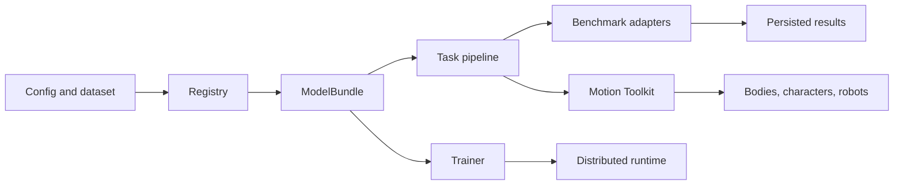

<p align="center">
  
</p>

<p align="center">
  <strong>Open infrastructure for human motion models, benchmarks, and interoperable motion data.</strong>
</p>

<p align="center">
  Train, run, compare, and connect motion systems without rebuilding the runtime around every method.
</p>

<p align="center">
  <a href="https://www.python.org/"></a>
  <a href="https://pytorch.org/"></a>
  <a href="docs/model_zoo/README.md"></a>
  <a href="docs/datasets/README.md"></a>
  <a href="docs/leaderboards/README.md"></a>
</p>

<p align="center">
  <a href="#start-here">🚀 Start</a> ·
  <a href="docs/tasks/README.md">🧭 Tasks</a> ·
  <a href="docs/datasets/README.md">Datasets</a> ·
  <a href="docs/model_zoo/README.md">📦 Models</a> ·
  <a href="docs/leaderboards/README.md">📊 Benchmarks</a> ·
  <a href="docs/training/README.md">Training</a> ·
  <a href="docs/motion/README.md">🔄 Motion I/O</a> ·
  <a href="docs/architecture.md">🏗️ Architecture</a>
</p>

Motius packages motion methods behind consistent bundles, task pipelines,
trainers, evaluators, and representation bridges.

| Layer | Owns | Source of truth |
| --- | --- | --- |
| 🧭 **Task** | Input and output contract | [Task Registry](docs/tasks/README.md) |
| **Dataset** | Source assets, local layout, split, and access terms | [Dataset Hub](docs/datasets/README.md) |
| 📦 **Method** | Model, checkpoint, pipeline, and native representation | [Model Zoo](docs/model_zoo/README.md) |
| 📊 **Benchmark** | Dataset, split, protocol, evaluator, and persisted results | [Benchmark Hub](docs/leaderboards/README.md) |
| 🔄 **Motion data** | Representation, body, character, and robot conversion | [Motion Toolkit](docs/motion/README.md) |

<a id="start-here"></a>

## Start Here 🚀

Install from source:

```bash
git lfs install
git clone https://github.com/ZeyuLing/Motius.git
cd Motius
git lfs pull
python -m pip install -e ".[dev]"
```

Git LFS materializes the simulator meshes and USD assets used by the public
motion-tracking trainers.

Load any released checkpoint through its self-describing artifact:

```python
from motius import Pipeline

pipe = Pipeline.from_pretrained(
    "ZeyuLing/Motius-MoMask-HumanML3D",
    bundle_kwargs={"device": "cuda"},
)
motions = pipe.infer_text_to_motion(
    ["a person walks forward and then sits down"],
    [120],
)
print(motions[0].shape)  # (120, 263), HumanML3D physical scale
```

The artifact declares its trusted Motius pipeline, task APIs, required files,
and bundled dependencies. `Pipeline.from_pretrained` never executes Python code
from the checkpoint repository.

Continue with the [installation and smoke tests](docs/getting_started.md), then
choose a [dataset](docs/datasets/README.md), a
[task](docs/tasks/README.md), a released
[method](docs/model_zoo/README.md), or a
[benchmark](docs/leaderboards/README.md).

## Datasets

The [Dataset Hub](docs/datasets/README.md) records the official source,
Motius-hosted copy when one exists, expected local directory, supported tasks,
and benchmark split contract for every public dataset.

| Dataset | Access | Primary use |
| --- | --- | --- |
| [MotionHub](https://huggingface.co/datasets/ZeyuLing/MotionHub) | Motius Hugging Face release | Unified SMPL-H training across text, music, speech, and interaction data |
| [HumanML3D](docs/datasets/README.md#humanml3d) | Official reconstruction workflow plus Motius SMPL-H subsets | T2M/M2T and HumanML3D control benchmarks |
| [BABEL](https://huggingface.co/datasets/ZeyuLing/babel-official) | Motius official-layout pack; upstream terms apply | Sequential Text-to-Motion |
| [MotionFix](https://huggingface.co/datasets/ZeyuLing/MotionFix) · [PerMo](https://huggingface.co/datasets/ZeyuLing/PerMo) | Motius SMPL-H releases | Instruction and style/content motion editing |

[Browse all datasets, download commands, and protocol notes](docs/datasets/README.md).

## Task System 🧭

The [Task Registry](docs/tasks/README.md) is the only public task vocabulary.
Tasks are listed flat instead of being forced into overlapping modality or
capability families. Tracks such as prediction, in-betweening, sparse
keyframes, and TP2M remain inside their parent task.

| Task | Contract | Leaderboard settings |
| ---- | -------- | -------------------- |
| [Text-to-Motion](https://huggingface.co/spaces/ZeyuLing/t2m-humanml3d-leaderboard) | Text → motion | [SMPL Skeleton](https://huggingface.co/spaces/ZeyuLing/t2m-humanml3d-leaderboard) · [Unitree G1 Skeleton](https://huggingface.co/spaces/ZeyuLing/t2m-unitree-g1-leaderboard) |
| [Motion-to-Text](https://huggingface.co/spaces/ZeyuLing/m2t-humanml3d-leaderboard) | Motion → caption | [HumanML3D](docs/datasets/README.md#humanml3d) |
| [Sequential Text-to-Motion](https://huggingface.co/spaces/ZeyuLing/babel-sequential-generation-leaderboard) | Ordered prompts → continuous motion | [BABEL](docs/datasets/README.md#babel) |
| [Text-to-Multi-Person Motion](docs/leaderboards/text_to_multi_person_interhuman.md) | Interaction text → shared-frame actors | [InterHuman](docs/datasets/README.md#interhuman) |
| [Temporal Motion Completion](https://huggingface.co/spaces/ZeyuLing/temporal-condition-leaderboard) | Observed frames ± text → motion | [HumanML3D](docs/datasets/README.md#humanml3d) temporal tracks |
| [Kinematic Motion Control](docs/leaderboards/kinematic_motion_control.md) | Numeric geometry → motion | Native-skeleton protocol |
| [Part-Level Motion Control](https://huggingface.co/spaces/ZeyuLing/body-part-condition-humanml3d-leaderboard) | Body-region semantics → motion | [HumanML3D](docs/datasets/README.md#humanml3d) |
| [Motion Editing](https://huggingface.co/spaces/ZeyuLing/motion-edit-leaderboard) | Motion + semantic edit → motion | [PerMo](docs/datasets/README.md#permo) style/content · [MotionFix](docs/datasets/README.md#motionfix) |
| [Motion Repair](https://huggingface.co/spaces/ZeyuLing/motion-repair-brokenamass-leaderboard) | Corrupted motion ± support → motion | BrokenAMASS fixed-support · MoGenDiT, StableMotion, MotionCanvas |
| [Motion Reconstruction](docs/leaderboards/README.md#motion-reconstruction-humanml3d) | Motion → reconstructed motion | [HumanML3D](docs/datasets/README.md#humanml3d) |
| [Music-to-Dance](https://huggingface.co/spaces/ZeyuLing/music-to-dance-aistpp-leaderboard) | Music ± text → dance | [AIST++](docs/datasets/README.md#aistpp) |
| [Dance-to-Music](https://huggingface.co/spaces/ZeyuLing/dance-to-music-aistpp-leaderboard) | Dance → music | [AIST++](docs/datasets/README.md#aistpp) |
| [Speech-to-Gesture](https://huggingface.co/spaces/ZeyuLing/speech-to-gesture-beat2-leaderboard) | Speech ± caption → gesture | [BEAT2](docs/datasets/README.md#beat2) |
| [Monocular Motion Capture](https://huggingface.co/spaces/ZeyuLing/monocular-motion-capture-leaderboard) | Monocular RGB video → body motion | [3DPW Test](docs/datasets/README.md#3dpw) · [EMDB-1/2](docs/datasets/README.md#emdb) protocol support |
| [Motion Tracking](https://huggingface.co/spaces/ZeyuLing/motion-tracking-mujoco-leaderboard) | Reference motion + robot state → physical trajectory and action | [MuJoCo · LAFAN1-G1](https://huggingface.co/spaces/ZeyuLing/motion-tracking-mujoco-leaderboard) · [Isaac Lab · Unitree G1](https://huggingface.co/spaces/ZeyuLing/motion-tracking-isaaclab-leaderboard) |

Model cards use these exact labels. Benchmark settings use
`Task · Setting`, such as
`Text-to-Motion · SMPL Skeleton` and
`Sequential Text-to-Motion · BABEL`.

## Models And Benchmarks 📦

| Surface | Use it for | Includes |
| --- | --- | --- |
| **[Dataset Hub](docs/datasets/README.md)** | Download source data and choose the protocol-compatible copy | Motius-hosted releases, official sources, local layouts, splits, and license boundaries |
| 📦 **[Model Zoo](docs/model_zoo/README.md)** | Browse integrated methods; filter registered capabilities by task | 37 packages, native spaces, artifacts, papers, and validation boundaries |
| 📊 **[Benchmark Hub](docs/leaderboards/README.md)** | Compare persisted results under one protocol | 16 settings with public tables, metric contracts, and qualitative case explorers |
| ⚙️ **[Evaluator Zoo](docs/evaluator_zoo/README.md)** | Reuse a metric implementation | HumanML3D Official, MotionStreamer, InterCLIP, TMR-G1, AIST++, and joint-position evaluators |
| 🩺 **[Physical Metrics](docs/evaluation/physical_metrics.md)** | Diagnose motion quality without a semantic checkpoint | Foot slide, floating, jitter, dynamics, and floor penetration |

## Motion Interoperability 🔄

### Representation And Embodiment

<p align="center">
  
</p>

<p align="center">
  <code>HumanML3D-263</code> → <code>SMPL-22</code> → <code>SOMA-30</code> /
  <code>ARDY-Core-27</code> → <code>Unitree G1</code>
</p>

<p align="center">
  <a href="assets/motion/representation_demo/index.html"><strong>Open synchronized viewer</strong></a> ·
  <a href="docs/motion/representations.md">Representation matrix</a> ·
  <a href="docs/motion/conversion.md">Conversion API</a> ·
  <a href="docs/motion/retargeting.md">Retargeting routes</a>
</p>

The shared bridge connects native feature vectors, SMPL-family bodies,
kinematic skeletons, rigged characters, and robot embodiments. Exact routes
preserve source state; lossy joint-only and cross-skeleton routes expose their
IK or retargeting diagnostics.

Actor count is an orthogonal layout property. Single-person motion uses
`(T, D)`; paired and multi-person motion use `(T, A, D)` in one shared world
frame. The [GT InterX comparison](assets/motion/interhuman_representation_demo/interx_smplh_gt_G021T002A012R014_skeleton_smpl_mesh.gif)
and [Three.js viewer](assets/motion/interhuman_representation_demo/index.html)
show InterHuman-262 and SMPL-H under the same conversion contract.

### Character Export

<p align="center">
  
</p>

Any supported human-motion representation can pass through the SMPL-22 bridge
into a rigged FBX character. Compare the same motion as a skeleton, an SMPL
mesh, and four Mixamo characters in the
[30 fps character preview](assets/motion/fbx_character_demo/004822_skeleton_smpl_mixamo_1440_30fps.gif),
then follow the [FBX export guide](docs/motion/fbx.md). Starting from a static
humanoid instead? The [automatic rigging pipeline](docs/motion/rigging.md)
imports GLB/GLTF/FBX/OBJ/PLY/STL, fits and skins a canonical SMPL-22 armature,
and exports a rigged FBX or GLTF asset for the same motion bridge.

### Automatic Rigging: Diverse Meshes To Motion

Motius exposes two Auto-Rig paths behind `auto_rig_character()`: a fully local,
deterministic `template` baseline for upright T/A-pose humans, and an optional
`make_it_animatable` backend for characters with much wider shapes and
proportions. Both paths produce a Motius-compatible SMPL-22 bone subset that can
be driven through the existing FBX motion bridge.

The approved demo below starts from three downloaded, textured meshes. Input
audits verify zero armatures, Armature modifiers, vertex groups, and Actions;
the characters are then auto-rigged, normalized to the SMPL-22 contract, and
driven by the same stored 150-frame HumanML3D motion. The cyan/white overlay is
the generated skeleton, not a reference skeleton:

<p align="center">
  <a href="assets/motion/auto_rigging_demo/motius_multi_character_autorig_004822_960x540_30fps.mp4">
    
  </a>
</p>

Open the [full 960 × 540, 30 fps MP4](assets/motion/auto_rigging_demo/motius_multi_character_autorig_004822_960x540_30fps.mp4),
inspect the [machine-readable manifest](assets/motion/auto_rigging_demo/manifest.json),
or read the [Auto-Rig guide](docs/motion/rigging.md#verified-multi-character-demo).

The diverse-character demo uses the upstream Make-It-Animatable inference
backend, followed by Motius's Mixamo-to-SMPL22 normalization, motion retargeting,
orientation priors, validation, and rendering. The integration is explicit so
the media is not misrepresented as output from the simpler local template
fitter. Install the optional client and run it with:

```bash
pip install -e ".[auto-rig]"
python tools/auto_rig_character.py character.glb rigged.fbx \
  --method make-it-animatable --blender /path/to/blender
```

The public backend uploads the input mesh to a third-party Hugging Face Space;
use a trusted self-hosted endpoint for private assets. Auto-Rig creates the rest
rig and skin, while animation retargeting is a separate stage. This remains a
rigging and deformation smoke test, not proof of production-quality anatomy on
every mesh. See the guide for method boundaries, third-party attribution, and
the foot/head orientation limitations of position-only SMPL-22 motion.

## Train And Extend 🛠️

The [Training Hub](docs/training/README.md) is the source of truth for which
packages have Motius-native trainers. It documents data contracts, precision,
losses, distributed launch, full-state resume, checkpoint cadence, and output
layout. An integrated inference pipeline is not automatically advertised as
trainable.

Train a Python config locally or with Accelerate:

```bash
python tools/train.py path/to/config.py \
  --work-dir outputs/training/my_experiment --auto-resume
accelerate launch tools/train.py path/to/config.py \
  --work-dir outputs/training/my_distributed_experiment --auto-resume
```

A method package owns its model, bundle, trainer adapter, task pipeline, and
evaluation adapters. The common runtime owns distributed execution,
checkpoint I/O, registration, conversion, and lifecycle hooks.

Use the [architecture guide](docs/architecture.md) to add a package, the
[development guide](docs/development.md) for repository conventions, and the
[Training Hub](docs/training/README.md) for the supported-package matrix and
released recipes.

## Architecture 🏗️


```mermaid
flowchart LR
    C["Config and dataset"] --> R["Registry"]
    R --> B["ModelBundle"]
    B --> T["Trainer"]
    B --> P["Task pipeline"]
    P --> E["Benchmark adapters"]
    P --> M["Motion Toolkit"]
    T --> X["Distributed runtime"]
    E --> L["Persisted results"]
    M --> O["Bodies, characters, robots"]
```

The split is intentional: a method can change architecture without renaming
its task, a benchmark can change dataset without becoming a new method, and a
motion representation can change without silently changing evaluation space.

## Documentation 📚

| Goal | Guide |
| --- | --- |
| Install and run a first model | [Getting Started](docs/getting_started.md) |
| Download data and select the correct dataset copy | [Dataset Hub](docs/datasets/README.md) |
| Choose the correct public task name | [Task Registry](docs/tasks/README.md) |
| Find model packages and checkpoints | [Model Zoo](docs/model_zoo/README.md) |
| Compare methods under fixed protocols | [Benchmark Hub](docs/leaderboards/README.md) · [Evaluator Zoo](docs/evaluator_zoo/README.md) |
| Convert representations, bodies, or characters | [Motion Toolkit](docs/motion/README.md) |
| Understand or extend the runtime | [Architecture](docs/architecture.md) · [Development](docs/development.md) |
| Train or resume a supported package | [Training Hub](docs/training/README.md) · [Data Formats](docs/training/prism_tmr_hymotion_t2m.md) |

## Project Status 🚦

Motius is an active research release. Public artifacts are versioned,
evaluation protocols are persisted with their results, and method-specific
licenses and upstream attribution remain documented in each model card. Core
APIs may evolve as additional methods move onto the shared runtime.
