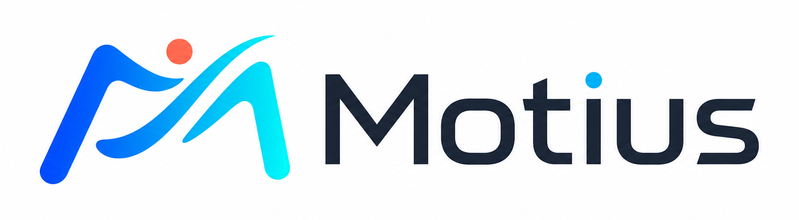

  

  <strong>Documentation for training, inference, evaluation, and motion interoperability.</strong>

  <a href="getting_started.md"><strong>Quickstart</strong></a> ·
  <a href="tasks/README.md">Tasks</a> ·
  <a href="datasets/README.md">Datasets</a> ·
  <a href="model_zoo/README.md">Models</a> ·
  <a href="training/README.md">Training</a> ·
  <a href="evaluator_zoo/README.md">Evaluators</a> ·
  <a href="leaderboards/README.md">Benchmarks</a> ·
  <a href="motion/README.md">Motion I/O</a>

# Documentation

Motius gives motion methods a shared runtime without hiding their native
representations, training procedures, or evaluation protocols. Use this page
as the stable entry point: start from the outcome you need, then move into the
corresponding source-of-truth guide.

## Choose a path

| I want to… | Start here | Continue with |
| --- | --- | --- |
| Install Motius and run a released checkpoint | [Getting Started](getting_started.md) | [Model Zoo](model_zoo/README.md) |
| Find the public contract for a motion task | [Task Registry](tasks/README.md) | [Dataset Hub](datasets/README.md) |
| Prepare data for training or evaluation | [Dataset Hub](datasets/README.md) | [Training Hub](training/README.md) |
| Train, resume, or reproduce a supported package | [Training Hub](training/README.md) | [Model cards](model_zoo/README.md) |
| Select an evaluator and compare methods fairly | [Evaluator Zoo](evaluator_zoo/README.md) | [Benchmark Hub](leaderboards/README.md) |
| Convert, retarget, rig, or export motion | [Motion Toolkit](motion/README.md) | [Representation reference](motion/representations.md) |
| Integrate a new method or runtime component | [Architecture](architecture.md) | [Development Guide](development.md) |

## How the pieces fit

| Surface | What it defines | Source of truth |
| --- | --- | --- |
| **Task** | Stable input/output vocabulary shared by pipelines, cards, and benchmarks | [Task Registry](tasks/README.md) |
| **Dataset** | Upstream source, Motius copy, local layout, split, and access boundary | [Dataset Hub](datasets/README.md) |
| **Method** | Model bundle, artifact, task pipelines, native representation, and support status | [Model Zoo](model_zoo/README.md) |
| **Training** | Supported trainers, configs, launch, state resume, and output layout | [Training Hub](training/README.md) |
| **Evaluation** | Metric implementation, motion space, checkpoint, and result contract | [Evaluator Zoo](evaluator_zoo/README.md) · [Benchmark Hub](leaderboards/README.md) |
| **Motion I/O** | Representation bridges, retargeting, character rigging, FBX export, and robot targets | [Motion Toolkit](motion/README.md) |

## End-to-end workflows

### Run a released method

1. Complete the [installation and smoke test](getting_started.md).
2. Choose a task from the [Task Registry](tasks/README.md).
3. Select an integrated package and artifact in the
   [Model Zoo](model_zoo/README.md).
4. Load the artifact with `Pipeline.from_pretrained(...)` and call its declared
   task API.

### Train and evaluate

1. Confirm the dataset source, local root, and split in the
   [Dataset Hub](datasets/README.md).
2. Check that the package has a Motius-native trainer and public config in the
   [Training Hub](training/README.md).
3. Match the prediction representation to an implementation in the
   [Evaluator Zoo](evaluator_zoo/README.md).
4. Persist results using the
   [evaluation artifact layout](evaluation/artifact_layout.md) before comparing
   them in the [Benchmark Hub](leaderboards/README.md).

### Move motion between representations and embodiments

1. Identify the source layout, coordinate frame, and frame rate in the
   [representation reference](motion/representations.md).
2. Follow the supported route matrix in the
   [conversion guide](motion/conversion.md).
3. Use [retargeting](motion/retargeting.md) for SOMA or Unitree G1 targets.
4. Use [automatic rigging](motion/rigging.md) and
   [FBX export](motion/fbx.md) for character assets.

### Add or release an integration

1. Read the runtime boundaries in [Architecture](architecture.md).
2. Follow repository and validation conventions in the
   [Development Guide](development.md).
3. Implement the task contract defined by the [Task Registry](tasks/README.md).
4. Apply the Model Zoo [release policy](model_zoo/release_policy.md) before
   advertising support.

## Reference index

| Area | Guides |
| --- | --- |
| Runtime | [Getting Started](getting_started.md) · [Architecture](architecture.md) · [Development](development.md) |
| Tasks and data | [Task Registry](tasks/README.md) · [Dataset Hub](datasets/README.md) |
| Methods and training | [Model Zoo](model_zoo/README.md) · [Training Hub](training/README.md) · [Release Policy](model_zoo/release_policy.md) |
| Evaluation | [Evaluator Zoo](evaluator_zoo/README.md) · [Benchmark Hub](leaderboards/README.md) · [Physical Metrics](evaluation/physical_metrics.md) · [Artifact Layout](evaluation/artifact_layout.md) |
| Motion interoperability | [Toolkit](motion/README.md) · [Representations](motion/representations.md) · [Conversion](motion/conversion.md) · [Retargeting](motion/retargeting.md) · [Rigging](motion/rigging.md) · [FBX Export](motion/fbx.md) |

## Documentation contract

The Task Registry owns public task names; the Dataset Hub owns access and
split boundaries; the Model Zoo owns package support; and the Benchmark Hub
owns published comparisons. If two pages appear to disagree, follow the page
that owns that contract and update downstream references rather than creating
a parallel definition.

<a href="../README.md">Back to the repository overview</a>

