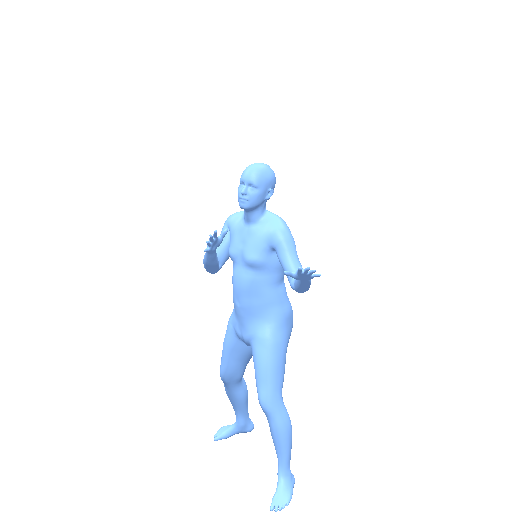
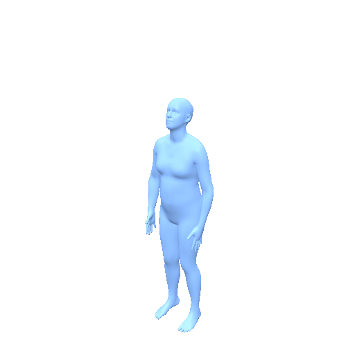
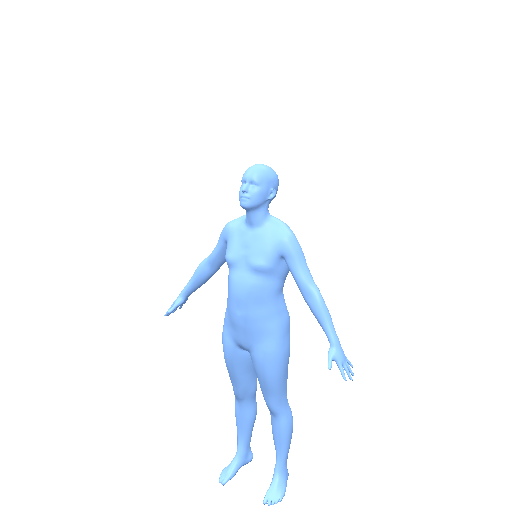

<h1 align="center">FlowMDM Model Card</h1>

<p align="center">
  <strong>Seamless multi-prompt human motion composition, packaged as a Motius pipeline.</strong>
</p>

<p align="center">
  <a href="https://arxiv.org/abs/2402.15509">Paper</a> |
  <a href="https://barquerogerman.github.io/FlowMDM/">Project Page</a> |
  <a href="https://github.com/BarqueroGerman/FlowMDM">Original GitHub</a> |
  <a href="https://huggingface.co/ZeyuLing/hftrainer-flowmdm-humanml3d">Motius Checkpoint</a>
</p>

FlowMDM is the motion composition baseline from *Seamless Human Motion
Composition with Blended Positional Encodings* (Barquero et al., CVPR 2024).
This Motius release packages the MDM-style diffusion model, blended positional
encoding sampler, HumanML3D statistics, and text-to-motion / multi-prompt
pipeline methods without requiring the original checkout.

## Preview

| HumanML3D Sample | Input Text | SMPL Preview |
| ---------------- | ---------- | ------------ |
| `001840` | someone executes a roundhouse kick with their left foot. |  |
| `004545` | a person jumping while raising both hands and moving apart legs. |  |
| `006944` | a person moves their right hand left, right, up, and down. |  |

512px / 30fps GIF previews rendered from released HumanML3D test outputs.

## Release Snapshot

| Item | Value |
| ---- | ----- |
| Method | FlowMDM, diffusion with blended positional encodings |
| Tasks | Text-to-Motion, sequential / multi-prompt Text-to-Motion |
| Venue | CVPR 2024 |
| Motion representation | HumanML3D-263, 20 fps |
| Checkpoint | [`ZeyuLing/hftrainer-flowmdm-humanml3d`](https://huggingface.co/ZeyuLing/hftrainer-flowmdm-humanml3d) |
| Pipeline | `motius.pipelines.flowmdm.FlowMDMPipeline` |

The checkpoint artifact contains `model000500000.pt`, `args.json`, `Mean.npy`,
`Std.npy`, and `model_index.json`.

## Usage

```python
from motius.pipelines.flowmdm import FlowMDMPipeline

pipe = FlowMDMPipeline.from_pretrained(
    "ZeyuLing/hftrainer-flowmdm-humanml3d",
    device="cuda",
)

motions = pipe.infer_t2m(
    ["a person walks forward then sits down"],
    [120],
)
```

Sequential multi-prompt generation is exposed through the same pipeline:

```python
motions = pipe.infer_sequential_t2m(
    [["a person walks forward", "then turns around"]],
    [[80, 80]],
)
```

`motions` is a list of NumPy arrays. Each array has shape `(T, 263)` and is
denormalized to HumanML3D physical scale.

## Evaluation Results

Protocol: HumanML3D Official uses the selected-caption HumanML3D test protocol. MotionStreamer Evaluator and Motius Joint-Position Evaluator are computed after converting outputs through the shared SMPL/SMPL-H evaluation bridge. For FID and MM-Dist, lower is better.

| Evaluator | Variant | Samples | R@1 | R@2 | R@3 | FID | MM-Dist | Diversity | Status |
| --------- | ------- | ------: | --: | --: | --: | --: | ------: | --------: | ------ |
| HumanML3D Official | Default | 3,970 | 0.439 | 0.636 | 0.744 | 0.327 | 3.387 | 9.942 | Measured |
| MotionStreamer Evaluator | Default | 4,042 | 0.474 | 0.650 | 0.731 | 36.377 | 20.002 | 25.178 | Measured |
| Motius Joint-Position Evaluator | Default | 4,034 | 0.439 | 0.615 | 0.711 | 227.494 | 37.410 | 55.513 | Measured |


## TP2M Results

FlowMDM also supports prefix-conditioned TP2M evaluation with the same
MotionStreamer Evaluator.

| Condition Frames | Samples | R@1 | R@2 | R@3 | FID | MM-Dist | Diversity |
| ----------------: | ------: | --: | --: | --: | --: | ------: | --------: |
| 1 | 3,968 | 0.449 | 0.630 | 0.706 | 83.773 | 19.872 | 26.365 |
| 5 | 3,968 | 0.481 | 0.654 | 0.729 | 75.853 | 19.456 | 26.467 |
| 9 | 3,968 | 0.490 | 0.664 | 0.742 | 71.338 | 19.262 | 26.625 |

## Motion Representation

FlowMDM generates HumanML3D-263 features at 20 fps. Per frame:

| Slice | Dim | Meaning |
| ----- | --- | ------- |
| `root_rot_vel` | 1 | root angular velocity |
| `root_lin_vel` | 2 | root linear velocity in the horizontal plane |
| `root_y` | 1 | root height |
| `ric_data` | 63 | local joint positions |
| `rot_data` | 126 | local joint rotations in continuous 6D format |
| `local_vel` | 66 | local joint velocities |
| `foot_contact` | 4 | binary foot-contact labels |


## Motius Components

| Component | Path |
| --------- | ---- |
| Pipeline | `motius.pipelines.flowmdm.FlowMDMPipeline` |
| Bundle | `motius.models.flowmdm.FlowMDMBundle` |
| Runtime | `motius.models.flowmdm.network` |

The SMPL visualizer branch from the original implementation is stubbed for T2M
inference because the released HumanML3D checkpoint predicts HumanML3D-263
features directly.

## Citation

```bibtex
@inproceedings{barquero2024seamless,
  title={Seamless Human Motion Composition with Blended Positional Encodings},
  author={Barquero, German and Escalera, Sergio and Palmero, Cristina},
  booktitle={Proceedings of the IEEE/CVF Conference on Computer Vision and Pattern Recognition},
  year={2024}
}
```
