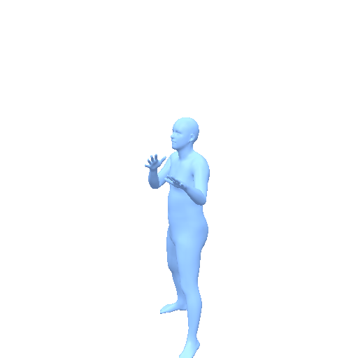
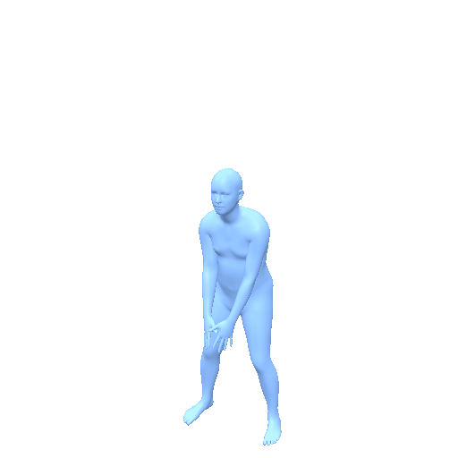
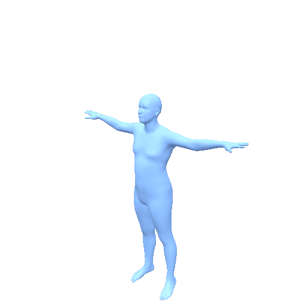

<h1 align="center">MaskControl Model Card</h1>

<p align="center">
  <strong>Masked motion synthesis with explicit spatial and temporal control.</strong>
</p>

<p align="center">
  <a href="https://arxiv.org/abs/2410.10780">Paper</a> |
  <a href="https://www.ekkasit.com/ControlMM-page/">Project Page</a> |
  <a href="https://github.com/exitudio/MaskControl">Original GitHub</a> |
  <a href="https://huggingface.co/ZeyuLing/motius-maskcontrol-humanml3d">Motius Checkpoint</a>
</p>

MaskControl is the method from *MaskControl: Spatio-Temporal Control for Masked
Motion Synthesis* (ICCV 2025). Motius reproduces its retrained MoMask base,
Logits Regularizer, differentiable expectation sampling, inference-time logits
optimization, residual transformer, RVQ-VAE, and CLIP text encoder without
importing an external MaskControl checkout at runtime.

## Preview

<table>
  <tr>
    <td width="33%"></td>
    <td width="33%"></td>
    <td width="33%"></td>
  </tr>
  <tr>
    <td><sub>"someone executes a roundhouse kick with their left foot."</sub></td>
    <td><sub>"the person swings a golf club."</sub></td>
    <td><sub>"a person moves their right hand left, right, up, and down."</sub></td>
  </tr>
</table>

All previews are selected-caption HumanML3D test outputs rendered as neutral
SMPL meshes at 512x512 and 30 fps. MP4 sources and fit diagnostics are stored
next to the GIF assets.

[Inspect the stratified GT/MaskControl audit](https://knights-ser-moment-work.trycloudflare.com/visualization/maskcontrol_humanml3d_fullsplit_audit18/).
The interactive Three.js viewer contains six typical cases, six uTMR semantic
tails, and six physical-quality tails selected from the complete 4,012-sample
evaluation set; every row exposes its caption and per-case diagnostics.

## Release Snapshot

| Item | Value |
| ---- | ----- |
| Tasks | T2M, Joint Control, Temporal Condition; experimental Body-Part Condition and Sequential Generation |
| Motion representation | HumanML3D-263 at 20 fps |
| Native T2M length | 40-196 frames |
| Extended control canvas | Up to 392 frames |
| Released control anchors | pelvis, left/right foot, head, left/right wrist |
| Checkpoint | [`ZeyuLing/motius-maskcontrol-humanml3d`](https://huggingface.co/ZeyuLing/motius-maskcontrol-humanml3d) |
| Pipeline | `motius.pipelines.maskcontrol.MaskControlPipeline` |
| Upstream revision audited | `71586fdeb1146ffe6b744d87d573febb10274237` |

The Hugging Face artifact is self-contained. It includes the control and base
transformers, RVQ-VAE, residual transformer, length estimator, OpenAI CLIP
ViT-B/32 tensors, normalization statistics, configuration, and provenance
metadata. `from_pretrained` does not download a second text encoder and does not
look under `ref_repo/`.

## Validation Status

API availability and output quality are tracked separately. The following
single-case audit uses HumanML3D test motion `006944` at 20 fps and native
recovered joints, before SMPL fitting. It is a diagnostic, not a replacement
for the complete benchmark tables below.

| Capability | Status | Condition error | Jerk p99 | Finding |
| ---------- | ------ | --------------: | --------: | ------- |
| T2M | Protocol parity verified | n/a | 388.7 m/s^3 | Native recovered joints agree with the released upstream sampler within `9.5e-7 m` |
| Joint control | Functional | 0.26 mm | 131.8 m/s^3 | The released six-joint anchors are followed accurately |
| Temporal prefix 20% | Functional | 1.02 mm | 107.3 m/s^3 | Prefix anchors and continuation run end to end |
| Temporal first + last | Under configuration audit | 3.11 mm | 317.6 m/s^3 | The paper's `each=100/final=600` recipe amplifies high-frequency motion on this sparse condition |
| Body-part timeline | Experimental, not quality-verified | n/a | 436.4 m/s^3 | The upstream repository still lists Body Part Timeline Control as unfinished |
| Sequential generation | Experimental, not benchmark-verified | n/a | n/a | Zero-shot composition API only; no complete BABEL result is released |

The official raw VQ, residual, and control checkpoints were compared with the
Hugging Face artifact tensor by tensor. Common tensors have zero maximum
absolute error; normalization-stat differences are below `6e-8`. Under the
same prompt, length, and seed, official and Motius T2M recovered joints differ
by at most `9.5e-7 m`.

An earlier release preview incorrectly initialized SMPL local rotations from
the HumanML3D rotation block. Those channels describe incoming HumanML3D bones
in its canonical frame and are not interchangeable with SMPL local joint
rotations. The public HML263-to-SMPL API now defaults to position IK followed
by all-joint refinement. The three previews above pass the SMPL fit gate with
mean joint errors of `15.2`, `20.7`, and `18.1 mm`; the native MaskControl
motions themselves were not the source of the malformed meshes.

## Control Contract

The released checkpoint is named `all joints` upstream, but its trained input is
36 channels built from delta and absolute XYZ for exactly six HumanML3D joints:
IDs `(0, 10, 11, 15, 20, 21)`. Motius exposes this boundary directly. A mask
that selects another joint raises an error instead of silently ignoring the
condition. A separate boolean mask represents observations, so `(0, 0, 0)` is
a valid target coordinate.

Experimental body-part timelines preserve previously generated lower/upper anchors while a
new prompt edits the requested interval. Sequential generation follows the
paper's zero-shot STMC composition: segments are generated independently, their
relative anchor trajectories are placed on one canvas, and an unconditional
control pass joins them. These two paths use the same released checkpoint; they
are not separately trained models and should not be treated as quality-verified
release tasks.

## Usage

Install the method dependencies and load the complete artifact:

```bash
python -m pip install -e '.[maskcontrol]'
```

```python
from motius.pipelines.maskcontrol import MaskControlPipeline

pipe = MaskControlPipeline.from_pretrained(
    "ZeyuLing/motius-maskcontrol-humanml3d",
    bundle_kwargs={"device": "cuda"},
    device="cuda",
)

motion = pipe.infer_t2m(
    ["a person walks forward and waves"],
    [120],
    seed=42,
)[0]
```

Temporal completion consumes physical-scale HumanML3D-263 reference motion:

```python
prediction = pipe.infer_temporal(
    ["a person turns and sits down"],
    [reference_hml263],
    mode="first_last",  # first_frame, prefix, boundary, or keyframes
    seed=42,
)[0]

# A real text-off setting uses no CLIP condition.
unconditional = pipe.infer_temporal(
    None,
    [reference_hml263],
    mode="prefix",
    seed=42,
)[0]
```

For explicit joint control, coordinates have shape `(B,T,22,3)` and the mask
has shape `(B,T,22)`:

```python
controlled = pipe.infer_control(
    ["a person reaches upward"],
    [120],
    target_joints=target_xyz,
    target_mask=observed,
    seed=42,
)[0]
```

Body-part and ordered multi-prompt composition use dedicated APIs:

```python
edited = pipe.infer_body_part(
    [
        {"parts": ["lower"], "text": "walk forward", "start": 0, "end": 120},
        {"parts": ["upper"], "text": "wave both hands", "start": 30, "end": 100},
    ],
    length=120,
    seed=42,
)

sequence = pipe.infer_sequential(
    ["walk forward", "turn left", "sit down"],
    [80, 60, 80],
    seed=42,
)
```

The public body-part timeline parser also accepts dictionaries with `parts`,
`text`, `start`, and `end`. All intervals are half-open `[start,end)` in 20fps
frames. Sequential inputs may total at most 392 frames, matching the released
checkpoint and paper extension.

## Evaluation Results

Motius uses the selected-caption HumanML3D test protocol and one deterministic
metric repeat. The release table is populated only from complete generated
sets; paper numbers remain separated below because their control conditions and
caption sampling differ.

| Evaluator | Retrieval N | R@1 | R@2 | R@3 | FID | MM-Dist | Diversity |
| --------- | ----------: | --: | --: | --: | --: | ------: | --------: |
| HumanML3D Official | 3,970 | 0.5381 | 0.7349 | 0.8271 | 0.1303 | 2.8631 | 9.6476 |
| MotionStreamer Evaluator | 4,000 | 0.6352 | 0.7863 | 0.8475 | 107.8315 | 18.3837 | 25.5946 |
| Motius Joint-Position Evaluator | 4,000 | 0.3930 | 0.5688 | 0.6708 | 0.6023 | 45.3203 | 49.7564 |

The Motius FID is computed in L2-normalized uTMR embedding space. Both cross
evaluators consume the same neutral-SMPL bridge: HML263 is fitted once to
SMPL-22 at 30 fps with position IK, then exported as joints66 or
MotionStreamer-272. All 4,012 generated samples pass shape and archive
validation. The retrieval metrics use 125 complete batches of 32; the 12-item
tail is excluded consistently from R-Precision and MM-Dist, while FID and
Diversity use all 4,012 samples. Across 879,012 fitted frames, the
HML263-to-SMPL joint error is `17.85 mm` on average and `23.56 mm` at P95.

### Physical Metrics

| Samples | Slide | Float | Jitter | Dynamic | Penetration |
| ------: | ----: | ----: | -----: | ------: | ----------: |
| 4,012 | 3.3457 | 8.6182 | 5.2911 | 22.1083 | 0.0000 |

These are the Motius SMPL-22 joint-level metrics in leaderboard display units.
`Dynamic` is an expressiveness statistic and is compared with GT rather than
minimized.

### Official Paper Results

The paper's random-joint HumanML3D control protocol reports R@3 `0.805`, FID
`0.083`, Diversity `9.395`, foot skate `0.0545`, and average control error
`0.72 cm`. Its pelvis-only protocol reports R@3 `0.809`, FID `0.061`,
Diversity `9.496`, and average control error `0.98 cm`.

For upper-body timeline editing, the paper reports R@1/2/3
`0.517/0.708/0.804`, FID `0.074`, MM-Dist `2.945`, and Diversity `9.380`.
The supplemental STMC no-padding composition reports R@1 `38.3`, R@3 `58.1`,
TMR `0.688`, FID `0.654`, M2T `0.511`, and transition distance `1.6` under its
own sequential protocol. These values are provenance references, not entries
on the Motius BABEL leaderboard.

## Reproduction

Generate the selected-caption T2M split with resumable sharding:

```bash
python tools/eval_maskcontrol_humanml3d.py \
  --artifact ZeyuLing/motius-maskcontrol-humanml3d \
  --annotation outputs/evaluation/t2m/maskcontrol_humanml3d_selected_jobs.json \
  --annotation-root . \
  --out-dir outputs/evaluation/maskcontrol/humanml3d_selected_caption \
  --batch-size 32 --skip-existing
```

Temporal and BABEL runners are provided at
`tools/eval_maskcontrol_temporal_humanml3d.py` and
`tools/generate_babel_sequential_maskcontrol.py`. The latter records episodes
that exceed the checkpoint's 392-frame canvas as `unsupported_length`; an
incomplete subset must not be submitted as a full BABEL leaderboard row.

The common neutral-SMPL bridge and physical metrics can be reproduced with:

```bash
python tools/materialize_hml263_smpl_joints.py \
  --ids-file outputs/evaluation/t2m/maskcontrol_humanml3d_official_intersection.txt \
  --hml263-dir outputs/evaluation/maskcontrol/humanml3d_selected_caption \
  --output-dir outputs/evaluation/maskcontrol/humanml3d_selected_smpl_position_ik_official4012 \
  --rotation-init position_ik \
  --smpl-model-dir checkpoints/body_models/smpl --device cuda

python tools/eval_physical_metrics.py \
  --ids-file outputs/evaluation/t2m/maskcontrol_humanml3d_official_intersection.txt \
  --joints-dir outputs/evaluation/maskcontrol/humanml3d_selected_smpl_position_ik_official4012/joints66 \
  --output outputs/evaluation/maskcontrol/metrics/physical_position_ik_official4012/result.json
```

## Motion Representation

MaskControl predicts standard HumanML3D-263 features: 4 root channels, 63
root-relative joint-position channels, 126 local joint-rotation channels, 66
local joint-velocity channels, and 4 foot-contact channels. Outputs are
physical-scale, not normalized model tensors, and can use the shared Motius
HumanML3D-to-SMPL conversion and rendering APIs.

## Attribution And License

The upstream project states that its code is distributed under CC BY-NC-ND
4.0 and that MoMask and other dependencies retain their own licenses. Motius
does not relicense the third-party weights. See
`motius/models/maskcontrol/ATTRIBUTIONS.md` before redistribution or commercial
use.

## Citation

```bibtex
@inproceedings{Pinyoanuntapong2025MaskControl,
  title={MaskControl: Spatio-Temporal Control for Masked Motion Synthesis},
  author={Pinyoanuntapong, Ekkasit and Saleem, Muhammad and Karunratanakul,
          Korrawe and Wang, Pu and Xue, Hongfei and Chen, Chen and Guo, Chuan
          and Cao, Junli and Ren, Jian and Tulyakov, Sergey},
  booktitle={Proceedings of the IEEE/CVF International Conference on Computer Vision},
  pages={9955--9965},
  year={2025}
}
```
