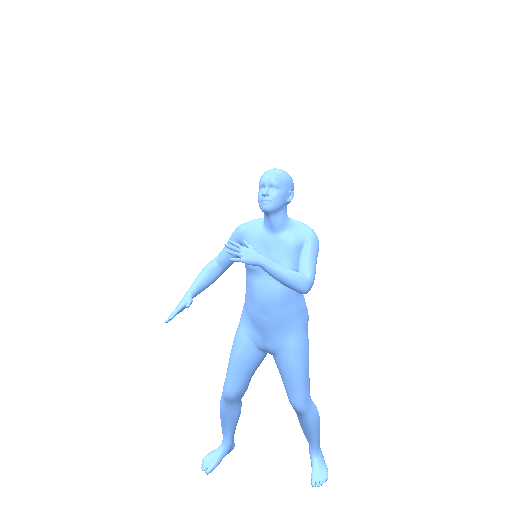
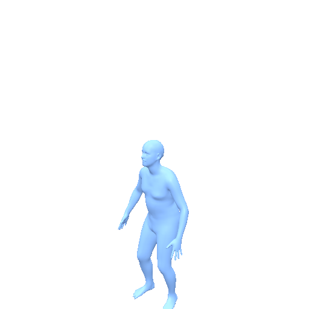
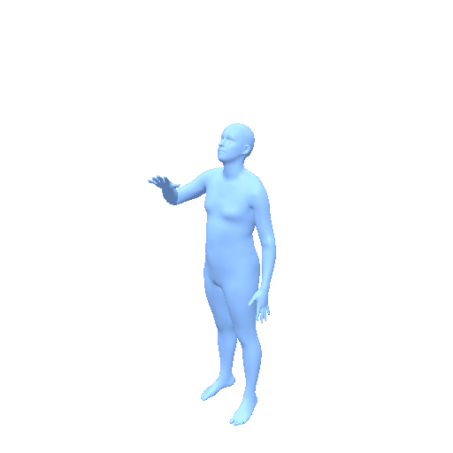

<h1 align="center">MoMask Model Card</h1>

<p align="center">
  <strong>Generative masked modeling for text-to-motion, packaged as a Motius pipeline.</strong>
</p>

<p align="center">
  <a href="https://arxiv.org/abs/2312.00063">Paper</a> |
  <a href="https://ericguo5513.github.io/momask/">Project Page</a> |
  <a href="https://github.com/EricGuo5513/momask-codes">Original GitHub</a> |
  <a href="https://huggingface.co/ZeyuLing/hftrainer-momask-humanml3d">Motius Checkpoint</a>
</p>

MoMask is the text-to-motion baseline from *MoMask: Generative Masked Modeling
of 3D Human Motions* (Guo et al., CVPR 2024). This Motius release packages the
RVQ-VAE tokenizer, masked token generator, residual token refiner, optional
length estimator, CLIP ViT-B/32 text encoder loading, and HumanML3D-263
denormalization behind a consistent inference pipeline.

## Preview

| HumanML3D Sample | Input Text | SMPL Preview |
| ---------------- | ---------- | ------------ |
| `001840` | someone executes a roundhouse kick with their left foot. |  |
| `004545` | a person jumping while raising both hands and moving apart legs. |  |
| `006944` | a person moves their right hand left, right, up, and down. |  |

512px / 30fps GIF previews rendered from released HumanML3D test outputs.

## Release Snapshot

| Item | Value |
| ---- | ----- |
| Method | MoMask, masked discrete motion token generation |
| Task | Text-to-Motion |
| Venue | CVPR 2024 |
| Motion representation | HumanML3D-263, 20 fps |
| Text encoder | CLIP ViT-B/32, frozen |
| Tokenizer | RVQ-VAE, 6 residual quantizers, 512-code codebook |
| Checkpoint | [`ZeyuLing/hftrainer-momask-humanml3d`](https://huggingface.co/ZeyuLing/hftrainer-momask-humanml3d) |
| Pipeline | `motius.pipelines.momask.MoMaskPipeline` |

The checkpoint artifact contains `vq.safetensors`, `t2m_trans.safetensors`,
`res_trans.safetensors`, `length_est.safetensors`, `clip.safetensors`,
`momask_config.json`, `Mean.npy`, and `Std.npy`.

## Usage

```python
from motius.pipelines.momask import MoMaskPipeline

pipe = MoMaskPipeline.from_pretrained(
    "ZeyuLing/hftrainer-momask-humanml3d",
    device="cuda",
)

motions = pipe.infer_t2m(
    ["a person walks forward then sits down"],
    [120],
)
```

`motions` is a list of NumPy arrays. Each array has shape `(T, 263)` and is
denormalized to HumanML3D physical scale. If `lengths` is omitted, the packaged
length estimator samples a token length from the prompt embedding.

## Evaluation Results

Protocol: HumanML3D Official uses the selected-caption HumanML3D test protocol. MotionStreamer Evaluator and Motius Joint-Position Evaluator are computed after converting outputs through the shared SMPL/SMPL-H evaluation bridge. For FID and MM-Dist, lower is better.

| Evaluator | Variant | Samples | R@1 | R@2 | R@3 | FID | MM-Dist | Diversity | Status |
| --------- | ------- | ------: | --: | --: | --: | --: | ------: | --------: | ------ |
| HumanML3D Official | Default | 3,970 | 0.516 | 0.709 | 0.804 | 0.097 | 2.990 | 9.460 | Measured |
| MotionStreamer Evaluator | Default | 4,042 | 0.640 | 0.797 | 0.861 | 21.073 | 18.122 | 25.979 | Measured |
| Motius Joint-Position Evaluator | Default | 4,034 | 0.567 | 0.754 | 0.836 | 143.543 | 33.312 | 56.611 | Measured |


## Motion Representation

MoMask generates HumanML3D-263 features at 20 fps. Per frame:

| Slice | Dim | Meaning |
| ----- | --- | ------- |
| `root_rot_vel` | 1 | root angular velocity |
| `root_lin_vel` | 2 | root linear velocity in the horizontal plane |
| `root_y` | 1 | root height |
| `ric_data` | 63 | local joint positions |
| `rot_data` | 126 | local joint rotations in continuous 6D format |
| `local_vel` | 66 | local joint velocities |
| `foot_contact` | 4 | binary foot-contact labels |

The RVQ-VAE downsamples motion by a factor of four frames. A 196-frame motion
maps to 49 token positions, each represented by 6 residual quantizers.


## Motius Components

| Component | Path |
| --------- | ---- |
| Pipeline | `motius.pipelines.momask.MoMaskPipeline` |
| Bundle | `motius.models.momask.MoMaskBundle` |
| Runtime | `motius.models.momask.network` |

The runtime is independent from the original checkout for inference. Raw
upstream checkpoint conversion remains outside this public release surface.

## Citation

```bibtex
@inproceedings{guo2024momask,
  title={MoMask: Generative Masked Modeling of 3D Human Motions},
  author={Guo, Chuan and Mu, Yuxuan and Javed, Muhammad Gohar and Wang, Sen and Cheng, Li},
  booktitle={Proceedings of the IEEE/CVF Conference on Computer Vision and Pattern Recognition},
  year={2024}
}
```
