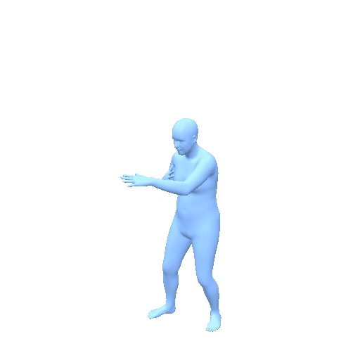
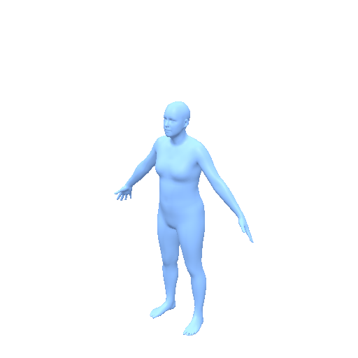
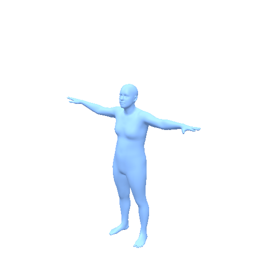

<h1 align="center">MotionStreamer Model Card</h1>

<p align="center">
  <strong>Streaming text-to-motion generation with a causal latent motion space.</strong>
</p>

<p align="center">
  <a href="https://arxiv.org/abs/2503.15451">Paper</a> |
  <a href="https://zju3dv.github.io/MotionStreamer/">Project Page</a> |
  <a href="https://github.com/zju3dv/MotionStreamer">Original GitHub</a> |
  <a href="https://huggingface.co/ZeyuLing/hftrainer-motionstreamer-humanml272">Motius Checkpoint</a>
</p>

MotionStreamer is a streaming text-to-motion model that combines a causal TAE,
a LLaMA-style autoregressive transformer, and a per-token diffusion head. This
Motius release packages the TAE, AR model, diffusion sampler, normalization
statistics, and task-facing pipeline without requiring the original checkout.

## Preview

| HumanML3D Sample | Input Text | SMPL Preview |
| ---------------- | ---------- | ------------ |
| `001840` | someone executes a roundhouse kick with their left foot. |  |
| `004545` | a person jumping while raising both hands and moving apart legs. |  |
| `006944` | a person moves their right hand left, right, up, and down. |  |

512px / 30fps GIF previews rendered from released HumanML3D test outputs.

## Release Snapshot

| Item | Value |
| ---- | ----- |
| Method | MotionStreamer, diffusion autoregression in causal latent space |
| Tasks | Streaming Text-to-Motion, TP2M, sequential / multi-prompt generation |
| Venue | ICCV 2025 |
| Motion representation | MotionStreamer-272, 30 fps |
| Text encoder | SentenceT5-XXL |
| Checkpoint | [`ZeyuLing/hftrainer-motionstreamer-humanml272`](https://huggingface.co/ZeyuLing/hftrainer-motionstreamer-humanml272) |
| Pipeline | `motius.pipelines.motionstreamer.MotionStreamerPipeline` |

The checkpoint artifact contains `tae.safetensors`, `ar.safetensors`,
`ms_config.json`, `Mean.npy`, `Std.npy`, and `model_index.json`.

## Usage

```python
from motius.pipelines.motionstreamer import MotionStreamerPipeline

pipe = MotionStreamerPipeline.from_pretrained(
    "ZeyuLing/hftrainer-motionstreamer-humanml272",
    device="cuda",
)

motions = pipe.infer_t2m(
    ["a person squats down and jumps up quickly"],
    [120],
)
```

Sequential streaming generation is exposed through the same pipeline:

```python
motions = pipe.infer_sequential_t2m(
    [["a person walks forward", "then raises both hands"]],
    [[80, 80]],
)
```

TP2M uses a MotionStreamer-272 prefix:

```python
motions = pipe.infer_tp2m(
    ["a person continues walking forward"],
    [160],
    [gt_motion_272],
    condition_num_frames=5,
)
```

`motions` is a list of NumPy arrays. Each array has shape `(T, 272)` and is
denormalized to MotionStreamer-272 physical scale.

## Evaluation Results

Protocol: HumanML3D Official uses the selected-caption HumanML3D test protocol. MotionStreamer Evaluator and Motius Joint-Position Evaluator are computed after converting outputs through the shared SMPL/SMPL-H evaluation bridge. For FID and MM-Dist, lower is better.

| Evaluator | Variant | Samples | R@1 | R@2 | R@3 | FID | MM-Dist | Diversity | Status |
| --------- | ------- | ------: | --: | --: | --: | --: | ------: | --------: | ------ |
| HumanML3D Official | Default | 3,970 | 0.408 | 0.588 | 0.690 | 0.169 | 3.676 | 9.579 | Measured |
| MotionStreamer Evaluator | Default | 4,042 | 0.630 | 0.786 | 0.850 | 12.211 | 16.581 | 27.464 | Measured |
| Motius Joint-Position Evaluator | Default | 4,034 | 0.440 | 0.597 | 0.681 | 93.469 | 35.674 | 53.800 | Measured |


## TP2M Results

Protocol: HumanML3D TP2M official-test selected-caption splits scored with the
MotionStreamer-272 evaluator.

| Condition Frames | Samples | R@1 | R@2 | R@3 | FID | MM-Dist | Diversity |
| ----------------: | ------: | --: | --: | --: | --: | ------: | --------: |
| 1 | 3,904 | 0.617 | 0.780 | 0.850 | 12.479 | 16.849 | 27.134 |
| 5 | 3,904 | 0.628 | 0.786 | 0.853 | 11.214 | 16.586 | 27.144 |
| 9 | 3,904 | 0.633 | 0.788 | 0.856 | 11.077 | 16.486 | 27.381 |

## Motion Representation

MotionStreamer predicts a 272-dimensional global representation at 30 fps:

| Slice | Dim | Meaning |
| ----- | --- | ------- |
| root xz velocity | 2 | root planar velocity |
| root heading | 6 | continuous heading rotation |
| joint positions | 66 | 22 joints in xyz |
| joint velocities | 66 | 22 joint velocities |
| local rotations | 132 | 22 local 6D rotations |

The TAE temporal downsample factor is 4 frames per latent token. The pipeline
therefore clamps requested lengths to token-aligned frame counts.


## Motius Components

| Component | Path |
| --------- | ---- |
| Pipeline | `motius.pipelines.motionstreamer.MotionStreamerPipeline` |
| Bundle | `motius.models.motionstreamer.MotionStreamerBundle` |
| Runtime | `motius.models.motionstreamer.network` |

## Citation

```bibtex
@inproceedings{xiao2025motionstreamer,
  title={MotionStreamer: Streaming Motion Generation via Diffusion-based Autoregressive Model in Causal Latent Space},
  author={Xiao, Lixing and Lu, Shunlin and Pi, Huaijin and Fan, Ke and Pan, Liang and Zhou, Yueer and Feng, Ziyong and Zhou, Xiaowei and Peng, Sida and Wang, Jingbo},
  booktitle={Proceedings of the IEEE/CVF International Conference on Computer Vision},
  year={2025}
}
```
