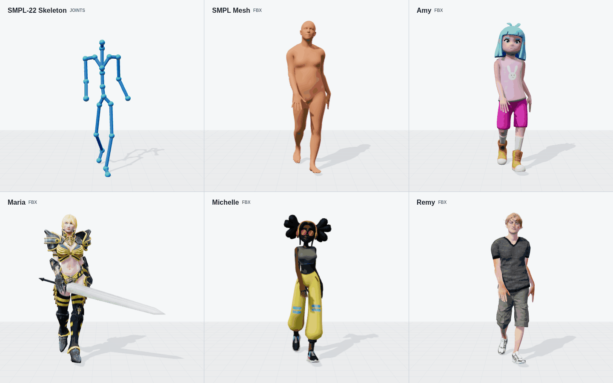
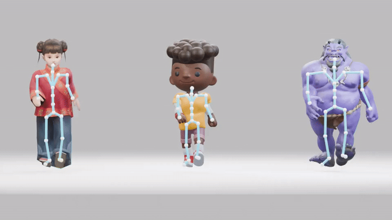

# Character Downloads and Demo Sources

[Motius demos](../../README.md#motius-in-motion) ·
[Motion Toolkit](README.md) · [FBX export](fbx.md) · [AutoRig](rigging.md)

This index records the source characters used in Motius's published demos.
The rendered media is committed to the repository; downloaded character
models are stored separately under `checkpoints/characters/` or `outputs/`.

## Mixamo: Amy, Maria, Michelle, and Remy

[Original 1440-pixel animation](../../assets/motion/fbx_character_demo/004822_skeleton_smpl_mixamo_1440_30fps.gif) ·
[MP4 video](../../assets/motion/fbx_character_demo/004822_skeleton_smpl_mixamo_1440_30fps.mp4) ·
[Demo manifest](../../assets/motion/fbx_character_demo/manifest.json) ·
[FBX export instructions](fbx.md)

Official character library:
[https://www.mixamo.com/](https://www.mixamo.com/)

Sign in, open the character library, and search for the names below. Download
a **T-Pose**, **FBX Binary**, **With Skin** file and install it at the matching
path. The retained demo records identify these four characters and the
official library; they do not retain individual download URLs.

| Character | Motius identifier | Local file |
| --- | --- | --- |
| Amy | `mixamo/amy` | `checkpoints/characters/mixamo/amy/character.fbx` |
| Maria | `mixamo/maria` | `checkpoints/characters/mixamo/maria/character.fbx` |
| Michelle | `mixamo/michelle` | `checkpoints/characters/mixamo/michelle/character.fbx` |
| Remy | `mixamo/remy` | `checkpoints/characters/mixamo/remy/character.fbx` |

See [Mixamo setup](../../checkpoints/characters/mixamo/README.md) for the
Python API. The Adobe character files are not redistributed in Motius.

## Textured Multi-Character AutoRig Demo

[Full 30 fps video](../../assets/motion/auto_rigging_demo/motius_multi_character_autorig_004822_960x540_30fps.mp4) ·
[Source and hash manifest](../../assets/motion/auto_rigging_demo/manifest.json) ·
[Rigging workflow](rigging.md#verified-multi-character-demo)

The original model pages recorded for the approved demo are:

| Character | Creator | Recorded license | Original model page |
| --- | --- | --- | --- |
| Little Girl Rigged 3D Model | CG-Moon | CC BY 4.0 | [https://sketchfab.com/3d-models/little-girl-rigged-3d-model-2b5c9b749a714dd6b0d04c7de83c254e](https://sketchfab.com/3d-models/little-girl-rigged-3d-model-2b5c9b749a714dd6b0d04c7de83c254e) |
| Running boy | Suushimi | CC BY-NC 4.0 | [https://sketchfab.com/3d-models/running-boy-0c80a9edd3514af0902349233d2c8d8f](https://sketchfab.com/3d-models/running-boy-0c80a9edd3514af0902349233d2c8d8f) |
| Yōkai Project: Oni | kornasale | CC BY 4.0 | [https://sketchfab.com/3d-models/yokai-project-oni-62f0e50b3f3543febaddd4834b05a84d](https://sketchfab.com/3d-models/yokai-project-oni-62f0e50b3f3543febaddd4834b05a84d) |

These pages identify the original assets. The rigging inputs used for the
demo were audited as static meshes with no armature, skin groups, or animation;
source model titles can still contain words such as "Rigged" or "Running".
Preserve the creator attribution and Running boy's non-commercial restriction
when reusing the demo. Source GLBs are not redistributed with Motius.

## Keeping Sources Discoverable

For new character demos, add the original model page, creator, license,
downloaded-file hash, and published media path to the demo manifest. Link that
manifest here and from the demo's README entry. Keep source links in versioned
documentation so they remain findable without access to a past conversation.
